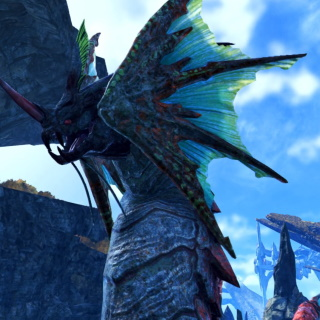

# Xenoblade3 ≫ エネミー一覧 ≫ 水生生物

生態調査中なので逐一更新中

## 種族一覧

- 魚類
    - [サモン族](#サモン族)
    - [クラディ族](#クラディ族)
    - [ギアーク族](#ギアーク族)
    - [モグルム族](#モグルム族)
- 哺乳類
    - [シルドン族](#シルドン族)
    - [シルマ族](#シルマ族)
    - [プクポカ族](#プクポカ族)
    - [ルドフィ族](#ルドフィ族)
- 爬虫類
    - [モウサ族](#モウサ族)
    - [レヴィダ族](#レヴィダ族)
- 植物
    - [アモネー族](#アモネー族)
- 亜人
    - [ハーキン族](#ハーキン族)
    - [アグーア族](#アグーア族)

## サモン族

### 生息場所・名前

| 地方             | [ロケーション](../../Maps/list.md) | 名前               | レベル |
| ---------------- | ---------------------------------- | ------------------ | ------ |
| アエティア地方   | 不死ヶ原/リカーロの池              | キリ・サモン       | 3      |
| アエティア地方   | イザナ平原                         | キリ・サモン       | 3-4    |
| フォーニス地方   | リビ平原/アグリア湖                | イルマ・サモン     | 17-18  |
| フォーニス地方   | レーベ高原/リエス湖                | ソール・サモン     | 21-23  |
| フォーニス地方   | レーベ高原/リエス湖                | 怪魚のシギナ       | 24     |
| アエティア地方   | イザナ平原/奏鳴の丘                | 醜怪のディープス   | 24     |
| アエティア地方   | イザナ平原                         | 湧泉のマスクィン   | 24     |
| ペンテランス地方 | コンティ大瀑布                     | オノコロ・サモン   | 27-28  |
| アエティア地方   | イザナ平原                         | マスラ・サモン     | 50-51  |
| アエティア地方   | メルナス高地/クーレル湖            | プラッシュ・サモン | 56     |
|                  |                                    |                    |        |

### ドロップアイテム

| アイテム             | ジェムクラフト | 必要数      |
| -------------------- | -------------- | ----------- |
| サモンのさっぱり白身 | 双撃IV         | レア×1      |
| サモンの紅色卵       | 祝いの洗練VIII | エピック×15 |
|                      |                |             |
|                      |                |             |

## クラディ族

### 生息場所・名前

| 地方           | [ロケーション](../../Maps/list.md) | 名前                 | レベル |
| -------------- | ---------------------------------- | -------------------- | ------ |
| カデンシア地方 | エルティア海/ビニング島            | ヴィクト・クラディ   | 43     |
| カデンシア地方 | エルティア海                       | ヴィクト・クラディ   | 45-47  |
| カデンシア地方 | エルティア海/ミグロウ浮遊列島      | ヴィクト・クラディ   | 46-47  |
| カデンシア地方 | アグヌス城下要塞/海風の浸食洞窟    | ヴィクト・クラディ   | 46     |
| カデンシア地方 | エルティア海/忘却のコロニー        | ズェーブラ・クラディ | 45-46  |
| カデンシア地方 | エルティア海/アルカフォール半島    | ハミシュ・クラディ   | 57-58  |
| カデンシア地方 | エルティア海                       | ハミシュ・クラディ   | 61-62  |
| カデンシア地方 | エルティア海                       | 水軍のギョルズ       | 75     |
|                |                                    |                      |        |

### ドロップアイテム

| アイテム | ジェムクラフト |     |
| -------- | -------------- | --- |
|          |                |     |
|          |                |     |

## ギアーク族

### 生息場所・名前

| 地方           | [ロケーション](../../Maps/list.md) | 名前               | レベル |
| -------------- | ---------------------------------- | ------------------ | ------ |
| カデンシア地方 | エルティア海/ミグロウ浮遊列島      | カリフォ・ギアーク | 45     |
| カデンシア地方 | エルティア海/サーベイン島          | カリフォ・ギアーク | 46-47  |
| カデンシア地方 | エルティア海                       | パシフィ・ギアーク | 63-64  |
| カデンシア地方 | エルティア海/パトゥリア湾          | パシフィ・ギアーク | 64     |
|                |                                    |                    |        |

### ドロップアイテム

| アイテム           | ジェムクラフト | 必要数      |
| ------------------ | -------------- | ----------- |
| ギアークの発光ヒレ | 溢れる闘気VIII | コモン×15   |
| ギアークの硬い尻尾 | 絶対反撃VIII   | コモン×15   |
| ギアークの硬い尻尾 | 双撃IX         | エピック×20 |
|                    |                |             |

## モグルム族

アンコウ

### 生息場所・名前
| 地方           | ロケーション                  | 名前               | レベル |
| -------------- | ----------------------------- | ------------------ | ------ |
| カデンシア地方 | エルティア海/ミグロウ浮遊列島 | グリラン・モグルム | 48     |
| カデンシア地方 | エルティア海/ファーレン岩窟道 | ブルラン・モグルム | 55     |
| カデンシア地方 | エルティア海/ディダーラ島     | イェラン・モグルム | 73     |
| カデンシア地方 | エルティア海/パトゥリア湾     | 暴食のバーバヤガ   | 84     |
|                |                               |                    |        |

### ドロップアイテム

| アイテム       | ジェムクラフト | 必要数    |
| -------------- | -------------- | --------- |
| モグルムの提灯 | 危険存在VIII   | コモン×15 |
|                |                |           |
|                |                |           |

## シルドン族

トド

### 生息場所・名前

| 地方             | [ロケーション](../../Maps/list.md) | 名前             | レベル |
| ---------------- | ---------------------------------- | ---------------- | ------ |
| ペンテランス地方 | コンティ大瀑布                     | コドン・シルドン | 28-29  |
| カデンシア地方   | エルティア海                       | ルボン・シルドン | 46     |
| カデンシア地方   | エルティア海                       | マモン・シルドン | 61-64  |
| ペンテランス地方 | コンティ大瀑布/コンティの源泉      | 長牙のドランパ   | 65     |
| カデンシア地方   | エルティア海/ディダーラ島          | ドドン・シルドン | 73-74  |
|                  |                                    |                  |        |

### ドロップアイテム

| アイテム       | ジェムクラフト | 必要数      |
| -------------- | -------------- | ----------- |
| シルドンの獣牙 | 斬鉄VIII       | エピック×15 |
| シルドンの甲羅 | 鉄壁の守りIX   | エピック×20 |
|                |                |             |
|                |                |             |

## シルマ族

トド

### 生息場所・名前

| 地方             | [ロケーション](../../Maps/list.md) | 名前           | レベル |
| ---------------- | ---------------------------------- | -------------- | ------ |
| ペンテランス地方 | コンティ大瀑布                     | コドン・シルマ | 27     |
| カデンシア地方   | エルティア海                       | マモン・シルマ | 61-62  |
| カデンシア地方   | エルティア海/パトゥリア湾          | マモン・シルマ | 62     |
| カデンシア地方   | エルティア海/ディダーラ島          | ドドン・シルマ | 73-74  |
| ペンテランス地方 | コンティ大瀑布/コンティの源泉      | 豊体のドランマ | 64     |
|                  |                                    |                |        |

### ドロップアイテム

| アイテム             | ジェムクラフト | 必要数      |
| -------------------- | -------------- | ----------- |
| シルマの濃厚海ミルク | 溢れる闘気VIII | エピック×15 |
|                      |                |             |
|                      |                |             |

## プクポカ族

### 生息場所・名前

| 地方             | ロケーション                    | 名前               | レベル |
| ---------------- | ------------------------------- | ------------------ | ------ |
| ペンテランス地方 | コンティ大瀑布                  | シモ・プクポカ     | 29-30  |
| ペンテランス地方 | コンティ大瀑布                  | 泳戯のパルコ       | 31     |
| カデンシア地方   | エルティア海/ハーガン岬         | マキリ・プクポカ   | 46-47  |
| カデンシア地方   | エルティア海                    | ティキタ・プクポカ | 60-61  |
| カデンシア地方   | エルティア海/アルカフォール半島 | ティキタ・プクポカ | 60-61  |
|                  |                                 |                    |        |

### ドロップアイテム

| アイテム           | ジェムクラフト | 必要数      |
| ------------------ | -------------- | ----------- |
| プクポカの貝割り石 | 弛まぬ攻手VIII | エピック×15 |
|                    |                |             |
|                    |                |             |

## ルドフィ族

イルカ

### 生息場所・名前

| 地方           | ロケーション              | 名前             | レベル |
| -------------- | ------------------------- | ---------------- | ------ |
| カデンシア地方 | エルティア海              | ティコ・ルドフィ | 44     |
| カデンシア地方 | エルティア海/ヤシヤシ孤島 | ティコ・ルドフィ | 44-45  |
| カデンシア地方 | エルティア海              | チャコ・ルドフィ | 62-63  |
| カデンシア地方 | エルティア海/パトゥリア湾 | チャコ・ルドフィ | 62-63  |
|                |                           |                  |        |

### ドロップアイテム

| アイテム         | ジェムクラフト   | 必要数      |
| ---------------- | ---------------- | ----------- |
| ルドフィの耳骨   | さらなる祝福VIII | エピック×15 |
| ルドフィの花ヒゲ | 溢れる闘気VIII   | コモン×15   |
|                  |                  |             |
|                  |                  |             |

## モウサ族

### 生息場所・名前

| 地方           | ロケーション                  | 名前               | レベル |
| -------------- | ----------------------------- | ------------------ | ------ |
| カデンシア地方 | エルティア海/ミグロウ浮遊列島 | シーバイト・モウサ | 47-48  |
| カデンシア地方 | エルティア海/ラヴィア砂丘島   | スヴィム・モウサ   | 62     |
| カデンシア地方 | エルティア海/ビニング島       | 虐悦のブリゲイダー | 79     |
|                |                               |                    |        |
|                |                               |                    |        |

### ドロップアイテム

| アイテム         | ジェムクラフト | 必要数      |
| ---------------- | -------------- | ----------- |
| モウサの鋭い尻尾 | 弱点解析VIII   | エピック×15 |
|                  |                |             |

## レヴィダ族

### 生息場所・名前

| 地方           | ロケーション              | 名前                 | レベル |
| -------------- | ------------------------- | -------------------- | ------ |
| カデンシア地方 | エルティア海/アヌ群島     | エシェンド・レヴィダ | 72     |
| カデンシア地方 | エルティア海/パトゥリア湾 | エシェンド・レヴィダ | 72     |
| カデンシア地方 | エルティア海              | エシェンド・レヴィダ | 72-73  |
| カデンシア地方 | エルティア海/エイジス海域 | 覇海龍エンビレオ     | 110    |
|                |                           |                      |        |

### ドロップアイテム

| アイテム         | ジェムクラフト | 必要数    |
| ---------------- | -------------- | --------- |
| レヴィダの白銀骨 | 癒しの薫風VIII | コモン×15 |
|                  |                |           |

## アモネー族

### 生息場所・名前

| 地方             | ロケーション                  | 名前             | レベル |
| ---------------- | ----------------------------- | ---------------- | ------ |
| アエティア地方   | メルナス高地/クーレル水脈     | ポリマ・アモネー | 29     |
| ペンテランス地方 | コンティ大瀑布/アモネーの聖地 | ハナサ・アモネー | 30-31  |
| ペンテランス地方 | コンティ大瀑布                | 誘蕾のフラリス   | 32     |
| アエティア地方   | イザナ平原                    | ラヌラ・アモネー | 49-51  |
| アエティア地方   | ミリク平原                    | ラヌラ・アモネー | 48-49  |
| アエティア地方   | ミリク平原                    | 幽漂のストレイア | 51     |
| アエティア地方   | メルナス高地/クーレル湖       | ゲラン・アモネー | 57-58  |
|                  |                               |                  |        |

### ドロップアイテム

| アイテム         | ジェムクラフト | 必要数      |
| ---------------- | -------------- | ----------- |
| アモネーの擬態花 | 殺気消失VIII   | エピック×15 |
|                  |                |             |

## ハーキン族

七面鳥

### 生息場所・名前

| 地方           | ロケーション                    | 名前                   | レベル |
| -------------- | ------------------------------- | ---------------------- | ------ |
| カデンシア地方 | エルティア海/ディダーラ島       | ミンストレ・ハーキン   | 43     |
| カデンシア地方 | エルティア海/ディダーラ島       | レンジャー・ハーキン   | 44     |
| カデンシア地方 | エルティア海/ディダーラ島       | ジャベリン・ハーキン   | 44     |
| カデンシア地方 | エルティア海/第一石柱遺跡       | マスケティ・ハーキン   | 44-45  |
| カデンシア地方 | エルティア海/テンゲイト遺跡     | ジャベリン・ハーキン   | 45-46  |
| カデンシア地方 | エルティア海/テンゲイト遺跡     | マスケティ・ハーキン   | 45     |
| カデンシア地方 | エルティア海/テンゲイト遺跡     | ロードブラス・ハーキン | 47     |
| カデンシア地方 | エルティア海/テンゲイト遺跡     | ロードパイク・ハーキン | 47     |
| カデンシア地方 | エルティア海/アヌ群島           | マスケティ・ハーキン   | 47     |
| カデンシア地方 | エルティア海/アヌ群島           | ロードボルト・ハーキン | 48     |
| カデンシア地方 | エルティア海/テンゲイト遺跡     | 忠勇のハーキン         | 52     |
| カデンシア地方 | エルティア海/ラヴィア砂丘島     | ジャベリン・ハーキン   | 55     |
| カデンシア地方 | エルティア海/アルカフォール半島 | ジャベリン・ハーキン   | 55     |
| カデンシア地方 | エルティア海/アルカフォール半島 | マスケティ・ハーキン   | 57     |
| カデンシア地方 | エルティア海/アルカフォール半島 | ミンストレ・ハーキン   | 57     |
| カデンシア地方 | エルティア海/アルカフォール半島 | ロードパイク・ハーキン | 58     |
| カデンシア地方 | エルティア海/アルカフォール半島 | ロードナイト・ハーキン | 59     |
| カデンシア地方 | エルティア海/アルカフォール半島 | ロードボルト・ハーキン | 59     |
| カデンシア地方 | エルティア海/ラヴィア砂丘島     | マスケティ・ハーキン   | 56     |
| カデンシア地方 | エルティア海/ラヴィア砂丘島     | ミンストレ・ハーキン   | 55     |
| カデンシア地方 | エルティア海/ラヴィア砂丘島     | ロードパイク・ハーキン | 56     |
| カデンシア地方 | エルティア海/ラヴィア砂丘島     | ジャベリン・ハーキン   | 73     |
| カデンシア地方 | エルティア海/英霊の遺跡         | ジャベリン・ハーキン   | 73     |
| カデンシア地方 | エルティア海/英霊の遺跡         | レンジャー・ハーキン   | 74     |
| カデンシア地方 | エルティア海/ラヴィア砂丘島     | ミンストレ・ハーキン   | 73     |
| カデンシア地方 | エルティア海/ラヴィア砂丘島     | ロードパイク・ハーキン | 74     |
| カデンシア地方 | エルティア海/英霊の遺跡         | ロードブラス・ハーキン | 74     |
| カデンシア地方 | エルティア海/英霊の遺跡         | ロードナイト・ハーキン | 75     |
| カデンシア地方 | エルティア海/英霊の遺跡         | 義勇のハーキン         | 76     |
| カデンシア地方 | エルティア海/リベリオン・ケイヴ | ミンストレ・ハーキン   | 95     |
| カデンシア地方 | エルティア海/リベリオン・ケイヴ | エルボルト・ハーキン   | 96     |
| カデンシア地方 | エルティア海/リベリオン・ケイヴ | レンジャー・ハーキン   | 96     |
| カデンシア地方 | エルティア海/リベリオン・ケイヴ | ロードパイク・ハーキン | 96-99  |
| カデンシア地方 | エルティア海/リベリオン・ケイヴ | ジャベリン・ハーキン   | 97     |
| カデンシア地方 | エルティア海/亜人煉獄           | ロードブラス・ハーキン | 100    |
|                |                                 |                        |        |

### ドロップアイテム

| アイテム             | ジェムクラフト | 必要数      |
| -------------------- | -------------- | ----------- |
| ハーキンのおやつ海藻 | 癒しの薫風VIII | コモン×15   |
| ハーキンのお守り貝殻 | 命の担い手VIII | エピック×15 |
|                      |                |             |

## アグーア族

イグアナらしい

### 生息場所・名前

| 地方           | ロケーション                  | 名前                     | レベル |
| -------------- | ----------------------------- | ------------------------ | ------ |
| カデンシア地方 | エルティア海/海蜥蜴の潮溜まり | バード・アグーア         | 44     |
| カデンシア地方 | エルティア海/海蜥蜴の潮溜まり | マグアロー・アグーア     | 44-45  |
| カデンシア地方 | エルティア海/海蜥蜴の潮溜まり | ソードマン・アグーア     | 45-46  |
| カデンシア地方 | エルティア海/海蜥蜴の潮溜まり | ペネトレイト・アグーア   | 46     |
| カデンシア地方 | エルティア海                  | マグアロー・アグーア     | 46     |
| カデンシア地方 | エルティア海/アヌ群島         | セイラー・アグーア       | 48     |
| カデンシア地方 | エルティア海/ハーガン岬       | ソードマン・アグーア     | 46     |
| カデンシア地方 | エルティア海/ハーガン岬       | セイラー・アグーア       | 47     |
| カデンシア地方 | エルティア海/ハーガン岬       | バード・アグーア         | 48     |
| カデンシア地方 | エルティア海/オーシアス岩礁峡 | ジャベリン・アグーア     | 60-61  |
| カデンシア地方 | エルティア海/オーシアス岩礁峡 | バード・アグーア         | 61     |
| カデンシア地方 | エルティア海/オーシアス岩礁峡 | ブラッドバス・アグーア   | 64     |
| カデンシア地方 | エルティア海/オーシアス岩礁峡 | パイレーツ・アグーア     | 64     |
| カデンシア地方 | エルティア海/ディダーラ島     | マグアロー・アグーア     | 62     |
| カデンシア地方 | エルティア海/ディダーラ島     | ディスコード・アグーア   | 64     |
| カデンシア地方 | エルティア海/ディダーラ島     | ジャベリン・アグーア     | 71     |
| カデンシア地方 | エルティア海/ディダーラ島     | マグアロー・アグーア     | 71-73  |
| カデンシア地方 | エルティア海/ディダーラ島     | バード・アグーア         | 72     |
| カデンシア地方 | エルティア海/ディダーラ島     | ペネトレイト・アグーア   | 73     |
| カデンシア地方 | エルティア海/ディダーラ島     | ソードキル・アグーア     | 73     |
| カデンシア地方 | エルティア海/ディダーラ島     | ディスコード・アグーア   | 73     |
| カデンシア地方 | エルティア海/ディダーラ島     | ブラッドバス・アグーア   | 74     |
| カデンシア地方 | エルティア海/ディダーラ島     | マインドキル・アグーア   | 73-74  |
| カデンシア地方 | エルティア海/翠玉光の泉       | ミンストレ・アグーア     | 97     |
| カデンシア地方 | エルティア海/翠玉光の泉       | エンフォス・アグーア     | 97-98  |
| カデンシア地方 | エルティア海/翠玉光の泉       | マグレンジャー・アグーア | 97-98  |
| カデンシア地方 | エルティア海/翠玉光の泉       | ポセイドン・アグーア     | 97-98  |
| カデンシア地方 | エルティア海/翠玉光の泉       | デュエル・アグーア       | 98     |
|                |                               |                          |        |

### ドロップアイテム

| アイテム         | ジェムクラフト   | 必要数    |
| ---------------- | ---------------- | --------- |
| アグーアのお守り | さらなる祝福VIII | コモン×15 |
| アグーアの秘蔵塩 | 錬気救命VIII     | コモン×15 |
|                  |                  |           |

