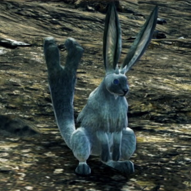
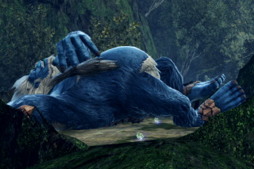
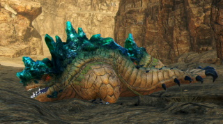
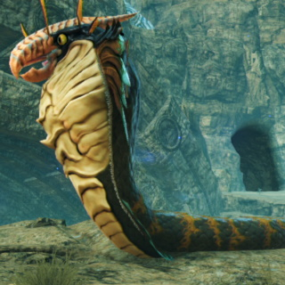
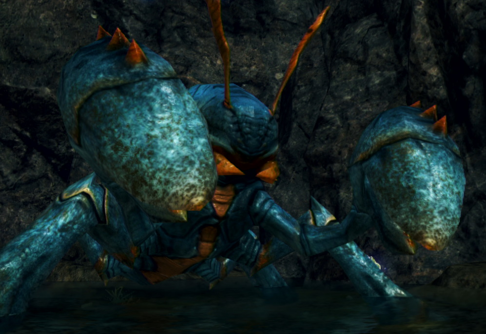

# Xenoblade3 ≫ エネミー一覧 ≫ 陸生生物

生態調査中なので逐一更新
独自で見つけた実績におけるレベル範囲を記載しているので、必ずしも正しい数字ではありません

## 種族一覧

- 哺乳類
    - [バニット族](#バニット族)
    - [ホッグス族](#ホッグス族)
    - [ピピット族](#ピピット族)
    - [ヴォルフ族](#ヴォルフ族)
    - [アルドン族](#アルドン族)
    - [アルマ族](#アルマ族)
    - [ハインド族](#ハインド族)
    - [カピーバ族](#カピーバ族)
    - [エルーク族](#エルーク族)
    - [ライノ族](#ライノ族)
    - [ゴゴール族](#ゴゴール族)
    - [アリエス族](#アリエス族)
    - [オリエス族](#オリエス族)
    - [バムガ族](#バムガ族)
- 鳥類？
    - [カミル族](#カミル族)
    - [フラミー族](#フラミー族)
    - [アーケシュ](#アーケシュ族)
    - [タスマン族](#タスマン族)
    - [ストラ族](#ストラ族)
- 爬虫類・両生類
    - [リィブラ族](#リィブラ族)
    - [グロッグ族](#グロッグ族)
    - [ラーナ族](#ラーナ族)
    - [アング族](#アング族)
    - [ウーパー族](#ウーパー族)
    - [ディブロ族](#ディブロ族)
    - [ダルドス族](#ダルドス族)
    - [ギラフェ族](#ギラフェ族)
- 虫
    - [キャピル族](#キャピル族)
    - [エルーカ族](#エルーカ族)
    - [スパイド族](#スパイド族)
    - [スコピオ族](#スコピオ族)
    - [アントル族](#アントル族)
- 甲殻類
    - [クライブ族](#クライブ族)
    - [パグール族](#パグール族)
    - [シュリブ族](#シュリブ族)
    - [ウニン族](#ウニン族)
- 亜人
    - [ターキン族](#ターキン族)
    - [イグーナ族](#イグーナ族)
- 植物
    - [バランド族](#バランド族)

## バニット族

うさぎ

### 生息場所・名前

| 地方             | [ロケーション](../../Maps/list.md) | 名前                 | レベル |
| ---------------- | ---------------------------------- | -------------------- | ------ |
| アエティア地方   | 不死ヶ原                           | リトル・バニット     | 2-3    |
| アエティア地方   | イザナ平原                         | ウッド・バニット     | 4      |
| アエティア地方   | イザナ平原                         | 追従のリリス         | 5      |
| アエティア地方   | メルナス高地                       | ハンド・バニット     | 7-8    |
| アエティア地方   | ミリク平原                         | ハンド・バニット     | 13     |
| アエティア地方   | イザナ平原                         | エクスノ・バニット   | 21-22  |
| アエティア地方   | メルナス高地/メルナス山道下層      | アーム・バニット     | 24-25  |
| アエティア地方   | メルナス高地/メルナス山道下層      | エクスノ・バニット   | 25-26  |
| アエティア地方   | メルナス高地/メルナス山道上層      | アーム・バニット     | 24     |
| アエティア地方   | メルナス高地/物見の一本橋          | アーム・バニット     | 25     |
| アエティア地方   | 不死ヶ原                           | ナベリオス・バニット | 42     |
| アエティア地方   | 不死ヶ原                           | ヴァラン・バニット   | 43     |
| アエティア地方   | 不死ヶ原                           | ファクト・バニット   | 43     |
| フォーニス地方   | レーベ高原/セイラス段丘            | ナックル・バニット   | 43-44  |
| フォーニス地方   | レーベ高原/ティルパの岩場          | ナックル・バニット   | 43-44  |
| カデンシア地方   | エルティア海/ミグロウ浮遊列島      | アイランド・バニット | 44-48  |
| フォーニス地方   | レーベ高原/エルセア山峡            | アルデラ・バニット   | 44-45  |
| ペンテランス地方 | インヴィディア山道                 | ラフィアン・バニット | 44-45  |
| ペンテランス地方 | インヴィディア山道                 | ナイルズ・バニット   | 46-47  |
| アエティア地方   | カプトコルヌ山嶺                   | ヒッター・バニット   | 48-49  |
| アエティア地方   | カプトコルヌ山嶺                   | スラッガー・バニット | 54-55  |
| アエティア地方   | エルガレス地下洞窟                 | グラップル・バニット | 77-78  |
| 大剣             | 滅光の虚/崩落した通路              | ヴォーパー・バニット | 88-89  |
|                  |                                    |                      |        |

### ドロップアイテム

| アイテム       | ジェムクラフト | 必要数      |
| -------------- | -------------- | ----------- |
| バニットの尻尾 | 双撃V          | レア×2      |
| バニットの尻尾 | 双撃VIII       | エピック×15 |
| バニットの肉   |                |             |

## ホッグス族

ハリネズミ

### 生息場所・名前

| 地方                   | [ロケーション](../../Maps/list.md) | 名前                 | レベル |
| ---------------------- | ---------------------------------- | -------------------- | ------ |
| フォーニス地方         | イーグス荒野/ラーダ峡谷道          | ナックル・ホッグス   | 12-13  |
| フォーニス地方         | イーグス荒野/ルイドの谷            | ナックル・ホッグス   | 12-13  |
| フォーニス地方         | イーグス荒野/掌中の長城            | ナックル・ホッグス   | 12-13  |
| フォーニス地方         | イーグス荒野/ラシンの大皿          | ラゴラ・ホッグス     | 14-15  |
| フォーニス地方         | イーグス荒野/ニールの谷            | ラゴラ・ホッグス     | 14-16  |
| ペンテランス地方       | コンティ大瀑布                     | ラフィアン・ホッグス | 28-29  |
| ペンテランス地方       | コンティ大瀑布/モランの橋          | ラフィアン・ホッグス | 28-29  |
| ペンテランス地方       | コンティ大瀑布                     | 地走のボックル       | 30     |
| ケヴェスキャッスル地方 | シウェラ浮遊岩礁地帯               | プラタン・ホッグス   | 36-37  |
| フォーニス地方         | エレス大道/カディオンの崖道        | ヴァラン・ホッグス   | 41-42  |
| カデンシア地方         | アグヌス城下要塞/海風の浸食洞窟    | ナイルズ・ホッグス   | 46     |
|                        |                                    |                      |        |

### ドロップアイテム

| アイテム | ジェムクラフト |     |
| -------- | -------------- | --- |
|          |                |     |

## ピピット族

### 生息場所・名前

| 地方             | [ロケーション](../../Maps/list.md) | 名前                 | レベル |
| ---------------- | ---------------------------------- | -------------------- | ------ |
| フォーニス地方   | リビ平原/カタラー兵陵              | リープ・ピピット     | 19     |
| ペンテランス地方 | インヴィディア坑道                 | 閃走のマルロ         | 28     |
| アエティア地方   | 不死ヶ原                           | キュートル・ピピット | 41-42     |
| カデンシア地方   | アグヌス城下要塞/極点の桟道        | ミーア・ピピット     | 44     |
| カデンシア地方   | エルティア海/ラディアルの眺望      | ポルカ・ピピット     | 57     |
| アエティア地方   | アルフェト渓谷                     | ネルヴァ・ピピット   | 68     |
| アエティア地方   | エルガレス地下洞窟                 | フォルーゼ・ピピット | 75-76  |
|                  |                                    |                      |        |

### ドロップアイテム

| アイテム             | ジェムクラフト | 必要数    |
| -------------------- | -------------- | --------- |
| ピピットの祝福ライト | 鋼の肉体VIII   | コモン×15 |
|                      |                |           |

## ヴォルフ族

### 生息場所・名前

| 地方                   | [ロケーション](../../Maps/list.md) | 名前               | レベル |
| ---------------------- | ---------------------------------- | ------------------ | ------ |
| アエティア地方         | アルフェト渓谷                     | レッサ・ヴォルフ   | 5-6    |
| アエティア地方         | アルフェト渓谷/ヴォルフのねぐら    | レッサ・ヴォルフ   | 8-9    |
| アエティア地方         | アルフェト渓谷/ヴォルフのねぐら    | 飢狗のヴィース     | 9      |
| フォーニス地方         | イーグス荒野/メノの大洞門          | ランド・ヴォルフ   | 13-15  |
| フォーニス地方         | イーグス荒野/掌中の長城            | ランド・ヴォルフ   | 13-15  |
| フォーニス地方         | イーグス荒野/ラシンの大皿          | ランド・ヴォルフ   | 13-15  |
| フォーニス地方         | イーグス荒野/長城の裏庭            | ランド・ヴォルフ   | 16-17  |
| フォーニス地方         | リビ平原/スパス丘陵                | ギロン・ヴォルフ   | 18-19  |
| フォーニス地方         | リビ平原/テラの荒地                | ギロン・ヴォルフ   | 18-19  |
| フォーニス地方         | リビ平原/ターキンの本営            | ギロン・ヴォルフ   | 18-19  |
| フォーニス地方         | リビ平原/グルンの坂道              | ギロン・ヴォルフ   | 18-19  |
| フォーニス地方         | リビ平原/カタラー兵陵              | ギロン・ヴォルフ   | 18-19  |
| ケヴェスキャッスル地方 | シウェラ浮遊岩礁地帯               | クラン・ヴォルフ   | 40-41     |
| アエティア地方         | 不死ヶ原                           | アグリー・ヴォルフ | 42-43  |
| アエティア地方         | カプトコルヌ山嶺                   | ジャック・ヴォルフ | 49-54  |
|                        |                                    |                    |        |

### ドロップアイテム

| アイテム | ジェムクラフト |     |
| -------- | -------------- | --- |
|          |                |     |

## フェリス族

### 生息場所・名前

| 地方           | [ロケーション](../../Maps/list.md) | 名前                 | レベル |
| -------------- | ---------------------------------- | -------------------- | ------ |
| フォーニス地方 | レーベ高原/ロミの丘                | ランド・フェリス     | 23-24  |
| カデンシア地方 | 大剣の麓/ノ・オム湿地帯            | クラン・フェリス     | 43-44  |
| カデンシア地方 | エルティア海/サーベイン港          | ソルダート・フェリス | 44     |
| カデンシア地方 | エルティア海/サーベイン島          | ソルダート・フェリス | 44     |
| フォーニス地方 | レーベ高原/セイラス段丘            | ロボノス・フェリス   | 45     |
| フォーニス地方 | レーベ高原/ティルパの岩場          | ロボノス・フェリス   | 44-45  |
| フォーニス地方 | レーベ高原/エルセア山峡            | ロボノス・フェリス   | 45     |
| カデンシア地方 | リ・ガート収容所/外郭森林区        | ロボノス・フェリス   | 48-49  |
|                |                                    |                      |        |

### ドロップアイテム

| アイテム       | ジェムクラフト | 必要数   |
| -------------- | -------------- | -------- |
| フェリスの双角 | 双撃III        | コモン×1 |
|                |                |          |

## アルドン族

牛

### 生息場所・名前

| 地方           | [ロケーション](../../Maps/list.md) | 名前                 | レベル |
| -------------- | ---------------------------------- | -------------------- | ------ |
| フォーニス地方 | リビ平原/スパス丘陵                | ムサイド・アルドン   | 18-19  |
| フォーニス地方 | リビ平原/スパス丘陵                | 老賢のオルダ         | 20     |
| フォーニス地方 | リビ平原/ネウス湖                  | ムサイド・アルドン   | 18-19  |
| フォーニス地方 | リビ平原/リペルの丘                | ムサイド・アルドン   | 18-19  |
| フォーニス地方 | レーベ高原/リーザの園              | アンクル・アルドン   | 23-24  |
| フォーニス地方 | レーベ高原/ロミの丘                | アンクル・アルドン   | 23     |
| フォーニス地方 | レーベ高原/デューマの顎            | アンクル・アルドン   | 24     |
| カデンシア地方 | 大剣の麓/ノ・オム湿地帯            | ダンプル・アルドン   | 40     |
| カデンシア地方 | エルティア海/ミグロウ浮遊列島      | ダンプル・アルドン   | 47-48  |
| カデンシア地方 | アグヌス城下要塞                   | バーサク・アルドン   | 50-52     |
| フォーニス地方 | レーベ高原/デューマの顎            | 千古角のグランデプス | 95     |

### ドロップアイテム

| アイテム       | ジェムクラフト | 必要数    |
| -------------- | -------------- | --------- |
| アルドンの王角 | 斬鉄VIII       | コモン×15 |
|                |                |           |

## アルマ族

牛

### 生息場所・名前

| 地方           | [ロケーション](../../Maps/list.md) | 名前             | レベル |
| -------------- | ---------------------------------- | ---------------- | ------ |
| フォーニス地方 | リビ平原/スパス丘陵                | プレイン・アルマ | 17-18  |
| フォーニス地方 | リビ平原/ネウス湖                  | プレイン・アルマ | 18     |
| フォーニス地方 | リビ平原/リペルの丘                | プレイン・アルマ | 17-18  |
| フォーニス地方 | レーベ高原/デューマの顎            | リトルアルマ     | 19     |
| フォーニス地方 | レーベ高原/リーザの園              | ダリア・アルマ   | 23     |
| フォーニス地方 | レーベ高原/リーザの園              | 幼気のリュミイ   | 23     |
| フォーニス地方 | レーベ高原/ロミの丘                | ダリア・アルマ   | 21-22  |
| カデンシア地方 | 大剣の麓/ノ・オム湿地帯            | バーレン・アルマ | 39-40  |
| カデンシア地方 | エルティア海/ミグロウ浮遊列島      | バーレン・アルマ | 45-47  |
| カデンシア地方 | エルティア海/ミグロウ浮遊列島      | ベビィ・アルマ   | 45-46  |
| カデンシア地方 | アグヌス城下要塞                   | キンダー・アルマ | 46     |
| カデンシア地方 | アグヌス城下要塞                   | グラース・アルマ | 48-50  |
|                |                                    |                  |        |

### ドロップアイテム

| アイテム               | ジェムクラフト | 必要数      |
| ---------------------- | -------------- | ----------- |
| アルマの熟成サーロイン | 鋼の肉体VIII   | エピック×15 |
|                        |                |             |

## ハインド族

### 生息場所・名前

| 地方             | [ロケーション](../../Maps/list.md) | 名前                 | レベル |
| ---------------- | ---------------------------------- | -------------------- | ------ |
| アエティア地方   | ミリク平原/ムームルの丘            | ルドニーク・ハインド | 24-25  |
| ペンテランス地方 | モルクナ大森林・上層               | サムイード・ハインド | 31-33  |
| フォーニス地方   | レーベ高原/エルセア山峡            | デモンド・ハインド   | 44-45  |
| フォーニス地方   | レーベ高原/悲嘆の谷                | デモンド・ハインド   | 44-45  |
| アエティア地方   | カプトコルヌ山嶺/ガヴァの三叉路    | スケイプ・ハインド   | 53-54  |
| ペンテランス地方 | モルクナ大森林・上層               | アブグラン・ハインド | 61-63  |
| ペンテランス地方 | コンティ大瀑布/コンティの源泉      | アブグラン・ハインド | 61-63  |
| フォーニス地方   | レーベ高原/悲嘆の谷                | 軒昇のニムルグ       | 68     |
|                  |                                    |                      |        |

### ドロップアイテム

| アイテム       | ジェムクラフト | 必要数    |
| -------------- | -------------- | --------- |
| ハインドの枝角 | 双撃IV         | レア×1    |
| ハインドの枝角 | 錬気救命IX     | コモン×20 |
|                |                |           |

## カピーバ

ビーバー

### 生息場所・名前

| 地方                   | [ロケーション](../../Maps/list.md) | 名前               | レベル |
| ---------------------- | ---------------------------------- | ------------------ | ------ |
| フォーニス地方         | リビ平原/アグリア湖                | パピリコ・カピーバ | 18     |
| フォーニス地方         | ダナ砂漠/ナバム丘陵                | チャピー・カピーバ | 24-25  |
| ケヴェスキャッスル地方 | シウェラ浮遊岩礁地帯/第三浮遊岩礁  | モコロコ・カピーバ | 35-36  |
| ケヴェスキャッスル地方 | シウェラ浮遊岩礁地帯/第二浮遊岩礁  | モコロコ・カピーバ | 35-36  |
| ケヴェスキャッスル地方 | シウェラ浮遊岩礁地帯/第一浮遊岩礁  | モコロコ・カピーバ | 35-36  |
| ケヴェスキャッスル地方 | シウェラ浮遊岩礁地帯/第三浮遊岩礁  | 怯儒のポガード     | 38     |
|                        |                                    |                    |        |

### ドロップアイテム

| アイテム       | ジェムクラフト | 必要数      |
| -------------- | -------------- | ----------- |
| カピーバの枝束 | 強化連撃VIII   | エピック×15 |
|                |                |             |

## エルーク族

### 生息場所・名前

| 地方           | [ロケーション](../../Maps/list.md) | 名前                 | レベル |
| -------------- | ---------------------------------- | -------------------- | ------ |
| アエティア地方 | カプトコルヌ山嶺/ラドラスの道      | スケイプ・エルーク   | 54     |
| カデンシア地方 | エルティア海/ファーレン岩窟道      | ウルコート・エルーク | 55     |
| カデンシア地方 | エルティア海/ファーレン岩窟道      | 駿脚のゴルターン     | 56     |
|                |                                    |                      |        |

### ドロップアイテム

| アイテム           | ジェムクラフト | 必要数      |
| ------------------ | -------------- | ----------- |
| エルークの光る枝角 | 追い風X        | エピック×30 |

## ライノ族

サイ

### 生息場所・名前

| 地方           | [ロケーション](../../Maps/list.md) | 名前               | レベル |
| -------------- | ---------------------------------- | ------------------ | ------ |
| アエティア地方 | エレス大道/テプノス丘陵            | ディノス・ライノ   | 42-43  |
| カデンシア地方 | エルティア海/潮風の展望地          | アーマード・ライノ | 48     |
| カデンシア地方 | エルティア海/アヌ群島              | アーマード・ライノ | 46-48     |
| カデンシア地方 | 大剣の麓/刃先の渓谷道              | アーマード・ライノ | 46-47     |
| カデンシア地方 | 大剣の麓                           | アーマード・ライノ | 47-48  |
| カデンシア地方 | 大剣の麓                           | 猪突のサイード     | 58     |
|                |                                    |                    |        |

### ドロップアイテム

| アイテム         | ジェムクラフト | 必要数     |
| ---------------- | -------------- | ---------- |
| ライノの鉄砕牙   | 双撃VII        | エピック×2 |
| ライノの太い尻尾 | 双撃VIII       | コモン×15  |
| ライノの鉄砕牙   | 双撃IX         | コモン×20  |
|                  |                |            |

## ゴゴール族

ゴリラ

### 生息場所・名前

| 地方             | [ロケーション](../../Maps/list.md) | 名前                 | レベル |
| ---------------- | ---------------------------------- | -------------------- | ------ |
| フォーニス地方   | エレス大道/ヒクタンの裂け目        | ドラム・ゴゴール     | 43-44  |
| フォーニス地方   | エレス大道/ロレーテの大岩棚        | ドラム・ゴゴール     | 43-44  |
| フォーニス地方   | レーベ高原/悲嘆の谷                | スロース・ゴゴール   | 45-46     |
| ペンテランス地方 | モルクナ大森林・上層               | コルサス・ゴゴール   | 33-35  |
| ペンテランス地方 | モルクナ大森林・上層               | エンヴィ・ゴゴール   | 44-45  |
| カデンシア地方   | エルティア海/アルカフォール半島    | マスクル・ゴゴール   | 54-59  |
| フォーニス地方   | エレス大道/ロレーテの大岩棚        | 邪鬼のゴンドバルト   | 74     |
| ペンテランス地方 | モルクナ大森林・下層               | ベルフェル・ゴゴール | 74     |
| カデンシア地方   | エルティア海/ディダーラ島          | ウォナック・ゴゴール | 75     |
| アエティア地方   | ミリク平原                         | 覇道のギガンテス     | 80     |
| ペンテランス地方 | モルクナ大森林・上層               | 不動のゴンザレス     | 88     |
|                  |                                    |                      |        |

### ドロップアイテム

| アイテム         | ジェムクラフト | 必要数      |
| ---------------- | -------------- | ----------- |
| ゴゴールの保存食 | 命の担い手VIII | コモン×15   |
| ゴゴールの秘蔵酒 | 呪術の洗練VIII | エピック×15 |
|                  |                |             |

## アリエス族

### 生息場所・名前

| 地方           | ロケーションorランドマーク    | 名前               | レベル |
| -------------- | ----------------------------- | ------------------ | ------ |
| アエティア地方 | カプトコルヌ山嶺              | マウント・アリエス | 48-49  |
| アエティア地方 | カプトコルヌ山嶺/ビューラの道 | 重蹄のトルファン   | 57     |
| アエティア地方 | カプトコルヌ山嶺/ビューラの道 | カロー・アリエス   | 65     |
| 大剣           | 滅光の虚                      | リトル・アリエス   | 87  |
| 大剣           | 滅光の虚                      | コスタ・アリエス   | 87-89  |
|                |                               |                    |        |

### ドロップアイテム

| アイテム       | ジェムクラフト | 必要数    |
| -------------- | -------------- | --------- |
| アリエスの毛皮 | 命の担い手VIII | コモン×15 |
|                |                |           |

## オリエス族

### 生息場所・名前

| 地方                   | [ロケーション](../../Maps/list.md) | 名前               | レベル |
| ---------------------- | ---------------------------------- | ------------------ | ------ |
| ケヴェスキャッスル地方 | シウェラ浮遊岩礁地帯/エクダソの崖  | コスタ・オリエス   | 41-42  |
| アエティア地方         | カプトコルヌ山嶺                   | マウント・オリエス | 50     |
| アエティア地方         | カプトコルヌ山嶺                   | 渦角のバックロウ   | 56     |
| アエティア地方         | カプトコルヌ山嶺/ビューラの道      | カリィ・オリエス   | 65     |
|                        |                                    |                    |        |

### ドロップアイテム

| アイテム | ジェムクラフト |     |
| -------- | -------------- | --- |
|          |                |     |

## バムガ族

### 生息場所・名前

| 地方           | [ロケーション](../../Maps/list.md) | 名前             | レベル |
| -------------- | ---------------------------------- | ---------------- | ------ |
| アエティア地方 | ミリク平原/紫陽仙境                | ジャック・バムガ | 69-70  |
| アエティア地方 | ミリク平原/紫陽仙境                | 凶狼のアランキ   | 70     |
|                |                                    |                  |        |

### ドロップアイテム

| アイテム     | ジェムクラフト | 必要数    |
| ------------ | -------------- | --------- |
| バムガの刃角 | 弛まぬ攻手VIII | コモン×15 |
|              |                |           |

## カミル族

### 生息場所・名前

| 地方           | [ロケーション](../../Maps/list.md) | 名前               | レベル |
| -------------- | ---------------------------------- | ------------------ | ------ |
| アエティア地方 | イザナ平原                         | グロウ・カミル     | 6      |
| アエティア地方 | アルフェト渓谷                     | グロウ・カミル     | 7-8    |
| フォーニス地方 | イーグス荒野/ルイドの谷            | カルム・カミル     | 13-14  |
| フォーニス地方 | イーグス荒野/掌中の長城            | カルム・カミル     | 13-14  |
| フォーニス地方 | イーグス荒野/ピエントの窪地        | カルム・カミル     | 13-14  |
| フォーニス地方 | イーグス荒野/レセント湖            | カルム・カミル     | 13-14  |
| フォーニス地方 | イーグス荒野/リコの泉              | カルム・カミル     | 13-14  |
| フォーニス地方 | エレス大道/ディースの石門          | オルミード・カミル | 41     |
| フォーニス地方 | エレス大道/ロレーテの大岩棚        | オルミード・カミル | 41-42  |
| フォーニス地方 | エレス大道/メナートの指間          | オルミード・カミル | 41-43  |
| フォーニス地方 | エレス大道/テプノス丘陵            | オルミード・カミル | 41-42  |
| カデンシア地方 | エルティア海/魔獣の手のひら        | ソールシス・カミル | 47-48     |
| カデンシア地方 | エルティア海/魔獣の手のひら        | サンドリオ・カミル | 48-49  |
| カデンシア地方 | エルティア海/デンテイト遺跡        | サンドリオ・カミル | 46-47  |
|                |                                    |                    |        |

### ドロップアイテム

| アイテム | ジェムクラフト |     |
| -------- | -------------- | --- |
|          |                |     |

## フラミー族

フラミンゴ

### 生息場所・名前

| 地方             | [ロケーション](../../Maps/list.md) | 名前               | レベル |
| ---------------- | ---------------------------------- | ------------------ | ------ |
| アエティア地方   | イザナ平原/フラミーの水場          | ケルブ・フラミー   | 3-4    |
| アエティア地方   | ミリク平原                         | リムド・フラミー   | 12-13  |
| アエティア地方   | ミリク平原/ムームルの丘            | マーシュ・フラミー | 23     |
| ペンテランス地方 | コンティ大瀑布                     | セラフ・フラミー   | 26-27     |
| カデンシア地方   | エルティア海/アヌ群島              | ビバーン・フラミー | 46-47  |
| カデンシア地方   | エルティア海/ハーガン岬            | ビバーン・フラミー | 45-47  |
|                  |                                    |                    |        |

### ドロップアイテム

| アイテム       | ジェムクラフト |             |
| -------------- | -------------- | ----------- |
| フラミーの細骨 | 追い風IX       | エピック×20 |

## アーケシュ族

### 生息場所・名前

| 地方             | ロケーションorランドマーク | 名前                   | レベル |
| ---------------- | -------------------------- | ---------------------- | ------ |
| ペンテランス地方 | モルクナ大森林・下層       | アタラクト・アーケシュ | 70-71  |
|                  |                            |                        |        |

### ドロップアイテム

| アイテム         | ジェムクラフト | 必要数    |
| ---------------- | -------------- | --------- |
| アーケシュの鉤爪 | 双撃VIII       | コモン×15 |
| アーケシュの薄翼 | 追い風IX       | レア×20   |
| アーケシュの薄翼 | 追い風X        | コモン×30 |
|                  |                |           |

## タスマン族

### 生息場所・名前

| 地方             | [ロケーション](../../Maps/list.md) | 名前                 | レベル |
| ---------------- | ---------------------------------- | -------------------- | ------ |
| アエティア地方   | ミリク平原                         | アガーメ・タスマン   | 8-11   |
| フォーニス地方   | リビ平原/シククの岩塊              | オルド・タスマン     | 19-21  |
| フォーニス地方   | リビ平原/スパス丘陵                | オルド・タスマン     | 19-21  |
| フォーニス地方   | ダナ砂漠/ナバム丘陵                | ディゲル・タスマン   | 21-22  |
| アエティア地方   | ミリク平原/ムームルの丘            | ロスアラ・タスマン   | 23-24  |
| アエティア地方   | 不死ヶ原                           | フライ・タスマン     | 42-43  |
| アエティア地方   | ミリク平原                         | フライ・タスマン     | 47-48  |
| アエティア地方   | カプトコルヌ山嶺/コロニー0         | キキット・タスマン   | 56-57  |
| アエティア地方   | カプトコルヌ山嶺/コロニー0         | 鋭穿のチキチキ       | 59     |
| カデンシア地方   | エルティア海/ブラス熱泉地帯        | ミステリオ・タスマン | 60-62  |
| カデンシア地方   | エルティア海/ラヴィア砂丘島        | トリルト・タスマン   | 61     |
| アエティア地方   | エルガレス地下洞窟                 | カディン・タスマン   | 77     |
| ペンテランス地方 | モルクナ大森林・下層/忘却の大洞穴  | シャンク・タスマン   | 92-93  |
|                  |                                    |                      |        |

### ドロップアイテム

| アイテム         | ジェムクラフト | 必要数      |
| ---------------- | -------------- | ----------- |
| タスマンの飾り羽 | 呪術の洗練VIII | エピック×15 |
|                  |                |             |

## ストラ族

### 生息場所・名前

| 地方             | [ロケーション](../../Maps/list.md) | 名前             | レベル |
| ---------------- | ---------------------------------- | ---------------- | ------ |
| ペンテランス地方 | モルクナ大森林・上層               | アヴィ・ストラ   | 31-32  |
| カデンシア地方   | アグヌス城下要塞/ディダーラ島      | チャドル・ストラ | 45-46  |
| カデンシア地方   | アグヌス城下要塞/海風の浸食洞窟    | チャドル・ストラ | 47-48  |
| カデンシア地方   | アグヌス城下要塞/極点の桟道        | チャドル・ストラ | 47-48  |
| ペンテランス地方 | モルクナ大森林・上層               | コックド・ストラ | 62-64  |
| ペンテランス地方 | コンティ大瀑布/コンティの源泉      | コックド・ストラ | 62-64  |
|                  |                                    |                  |        |

### ドロップアイテム

| アイテム       | ジェムクラフト | 必要数      |
| -------------- | -------------- | ----------- |
| ストラの草粉末 | 癒しの薫風VIII | エピック×15 |
| ストラの草粉末 | 追い風IX       | コモン×20   |
|                |                |             |

## リィブラ族

### 生息場所・名前

| 地方                   | [ロケーション](../../Maps/list.md) | 名前                     | レベル |
| ---------------------- | ---------------------------------- | ------------------------ | ------ |
| アエティア地方         | メルナス高地                       | ランドン・リィブラ       | 10     |
| フォーニス地方         | イーグス荒野/ルイドの谷            | アインタル・リィブラ     | 15-16  |
| フォーニス地方         | イーグス荒野/長城の裏庭            | アインタル・リィブラ     | 16     |
| フォーニス地方         | エレス大道/風鳴りの洞門            | アインタル・リィブラ     | 15-16  |
| アエティア地方         | メルナス高地/メルナス山道下層      | ロックイーター・リィブラ | 26     |
| アエティア地方         | メルナス高地/メルナス山道上層      | ロックイーター・リィブラ | 26-27  |
| アエティア地方         | メルナス高地/メルナス山道上層      | 岩喰いのジュドーマ       | 31     |
| ケヴェスキャッスル地方 | シウェラ浮遊岩礁地帯               | グラウン・リィブラ       | 38-39  |
| ケヴェスキャッスル地方 | シウェラ浮遊岩礁地帯/第七浮遊岩礁  | グラウン・リィブラ       | 38-39  |
| アエティア地方         | 不死ヶ原                           | コルヌクス・リィブラ     | 42-43     |
| カデンシア地方         | エルティア海/アヌ群島              | コルヌクス・リィブラ     | 46-47  |
| カデンシア地方         | アグヌス城下要塞/海風の浸食洞窟    | コルヌクス・リィブラ     | 46     |
| カデンシア地方         | エルティア海/ラヴィア砂丘島        | ヴァルト・リィブラ       | 63     |
| アエティア地方         | ミリク平原                         | オルドラ・リィブラ       | 69     |
| アエティア地方         | エルガレス地下洞窟                 | ベヒモット・リィブラ     | 79     |
|                        |                                    |                          |        |

### ドロップアイテム

| アイテム         | ジェムクラフト | 必要数      |
| ---------------- | -------------- | ----------- |
| リィブラの大アゴ | 双撃I          | コモンI     |
| リィブラの大アゴ | 絶対反撃VIII   | エピック×15 |
|                  |                |             |

## グロッグ族

カエル

### 生息場所・名前

| リージョン       | [ロケーション](../../Maps/list.md)  | 名前                   | レベル |
| ---------------- | ----------------------------------- | ---------------------- | ------ |
| アエティア地方   | ミリク平原/ビリエラ丘陵             | ヘヴィー・グロッグ     | 11-12  |
| アエティア地方   | イザナ平原                          | 舌禍のゴンババ         | 12     |
| フォーニス地方   | リビ平原/癒しの岸辺                 | ノブリス・グロッグ     | 20-21  |
| フォーニス地方   | リビ平原/アグリア湖                 | ノブリス・グロッグ     | 20     |
| アエティア地方   | イザナ平原                          | ヒメサマ・グロッグ     | 23     |
| アエティア地方   | ミリク平原/鬼哭洞                   | ヒメサマ・グロッグ     | 23     |
| ペンテランス地方 | コンティ大瀑布                      | イアン・グロッグ       | 27-28  |
| カデンシア地方   | アグヌス城下要塞/海風の浸食洞窟     | デトック・グロッグ     | 47-49  |
| アエティア地方   | カプトコルヌ山嶺/ノキルア腐敗溜まり | ゴライアス・グロッグ   | 57     |
| カデンシア地方   | エルティア海/ブラス熱泉地帯         | ビーゲスト・グロッグ   | 60-61  |
| ペンテランス地方 | モルクナ大森林・下層                | ビーゲスト・グロッグ   | 72-75  |
| アエティア地方   | ミリク平原                          | デスイーター・グロッグ | 79     |
| フォーニス地方   | リビ平原/癒しの岸辺                 | 暴悪のグロッケン       | 81     |
|                  |                                     |                        |        |

### ドロップアイテム

| アイテム         | ジェムクラフト | 必要数      |
| ---------------- | -------------- | ----------- |
| グロッグの暴走薬 | 双撃II         | コモン×1    |
| グロッグの暴走薬 | 絶対反撃VIII   | エピック×15 |
| グロッグの黄金油 | 追い風X        | エピック×30 |
|                  |                |             |

## ラーナ族

### 生息場所・名前

| リージョン       | [ロケーション](../../Maps/list.md) | 名前               | レベル |
| ---------------- | ---------------------------------- | ------------------ | ------ |
| カデンシア地方   | エルティア海/アルカフォール半島    | デトック・ラーナ   | 57-59  |
| カデンシア地方   | エルティア海/アルカフォール半島    | 欲心のゲロノドン   | 60     |
| ペンテランス地方 | モルクナ大森林・下層               | ビーゲスト・ラーナ | 72-73  |
|                  |                                    |                    |        |

### ドロップアイテム

| アイテム         | ジェムクラフト |          必要数   |
| ---------------- | -------------- | ----------- |
| ラーナの白レバー | 鋼の肉体VIII   | コモン×15 |
|                  |                |             |

## アング族

コブラ

### 生息場所・名前

| リージョン       | [ロケーション](../../Maps/list.md) | 名前               | レベル |
| ---------------- | ---------------------------------- | ------------------ | ------ |
| フォーニス地方   | イーグス荒野/ラシンの大皿          | ラトル・アング     | 14-15  |
| フォーニス地方   | イーグス荒野/ラシンの大皿          | 危難のジャラヘッド | 16     |
| フォーニス地方   | イーグス荒野/ニールの谷            | ストーク・アング   | 15-16  |
| フォーニス地方   | イーグス荒野/ベネル洞窟            | ストーク・アング   | 15-16  |
| フォーニス地方   | イーグス荒野/ゼームの四つ辻        | ストーク・アング   | 15-16  |
| フォーニス地方   | レーベ高原/カーナの古戦場          | マブルク・アング   | 23-24  |
| ペンテランス地方 | インヴィディア坑道/第三採掘場      | ブリッツ・アング   | 25     |
| フォーニス地方   | エレス大道/メナートの指間          | ボアヘッド・アング | 43-44  |
| フォーニス地方   | エレス大道/ゼインの大鉤爪          | ボアヘッド・アング | 43-44  |
| フォーニス地方   | エレス大道/ロレーテの大岩棚        | ボアヘッド・アング | 44     |
| フォーニス地方   | エレス大道/カディオンの崖道        | ボアヘッド・アング | 43-44  |
| ペンテランス地方 | モルクナ大森林・上層               | メナス・アング     | 44     |
| カデンシア地方   | エルティア海/ファーレン岩窟道      | フォアラ・アング   | 54     |
|                  |                                    |                    |        |

### ドロップアイテム

| アイテム     | ジェムクラフト | 必要数      |
| ------------ | -------------- | ----------- |
| アングの眼球 | 殺気消失VIII   | エピック×15 |
|              |                |             |

## ウーパー族

ウーパールーパー

### 生息場所・名前

| リージョン       | [ロケーション](../../Maps/list.md) | 名前               | レベル |
| ---------------- | ---------------------------------- | ------------------ | ------ |
| フォーニス地方   | レーベ高原/デューマの顎            | ワーコン・ウーパー | 23-24  |
| フォーニス地方   | レーベ高原/リエス湖                | ワーコン・ウーパー | 23-24  |
| フォーニス地方   | レーベ高原/カーナの古戦場          | ワーコン・ウーパー | 22-23  |
| フォーニス地方   | レーベ高原/セイラス段丘            | ワーコン・ウーパー | 23-24  |
| フォーニス地方   | レーベ高原/カーナの古戦場          | 異端のサウロ       | 25     |
| ペンテランス地方 | 断崖の古道                         | マッド・ウーパー   | 30-31  |
| カデンシア地方   | アグヌス城下要塞/海風の浸食洞窟    | モイスト・ウーパー | 45     |
| カデンシア地方   | エルティア海/アルカフォール半島    | ウェット・ウーパー | 57     |
| カデンシア地方   | エルティア海/至天の滝              | ウェット・ウーパー | 58-59  |
|                  |                                    |                    |        |

### ドロップアイテム

| アイテム           | ジェムクラフト | 必要数      |
| ------------------ | -------------- | ----------- |
| ウーパーの豪華提灯 | 危険存在VIII   | エピック×15 |
|                    |                |             |

## ディブロ族

### 生息場所・名前

| リージョン       | [ロケーション](../../Maps/list.md) | 名前                 | レベル |
| ---------------- | ---------------------------------- | -------------------- | ------ |
| ペンテランス地方 | コンティ大瀑布                     | スポックド・ディブロ | 27-28  |
| ペンテランス地方 | コンティ大瀑布/清流の隠し入り江    | 居突のジャルシャ     | 37     |
| カデンシア地方   | エルティア海/アルカフォール半島    | アキニス・ディブロ   | 56-58  |
|                  |                                    |                      |        |

### ドロップアイテム

| アイテム             | ジェムクラフト | 必要数      |
| -------------------- | -------------- | ----------- |
| ディブロのノコギリ牙 | 斬鉄VIII       | エピック×15 |
|                      |                |             |

## ダルドス族

### 生息場所・名前

| リージョン     | [ロケーション](../../Maps/list.md) | 名前                   | レベル |
| -------------- | ---------------------------------- | ---------------------- | ------ |
| フォーニス地方 | リビ平原/リペルの丘                | ピゲス・ダルドス       | 45-46  |
| フォーニス地方 | リビ平原/スパス丘陵                | ピゲス・ダルドス       | 45-46  |
| フォーニス地方 | イーグス荒野/ラシンの大皿          | ログネイト・ダルドス   | 50     |
| カデンシア地方 | エルティア海/ディダーラ島          | ヴァリアード・ダルドス | 75     |
| アエティア地方 | エルガレス地下洞窟                 | 牙獣王クラヴェイン     | 80     |
|                |                                    |                        |        |

### ドロップアイテム

| アイテム           | ジェムクラフト | 必要数    |
| ------------------ | -------------- | --------- |
| ダルドスの鉱石骨   | 斬鉄VIII       | コモン×15 |
| ダルドスの紅色結晶 | 双撃X          | レア×30   |
|                    |                |           |

## ギラフェ族

### 生息場所・名前

| リージョン     | [ロケーション](../../Maps/list.md) | 名前                 | レベル |
| -------------- | ---------------------------------- | -------------------- | ------ |
| フォーニス地方 | リビ平原/テラの荒地                | マイルズ・ギラフェ   | 18-19  |
| フォーニス地方 | リビ平原/カタラー兵陵              | マイルズ・ギラフェ   | 18-19  |
| フォーニス地方 | リビ平原/グルンの坂道              | マイルズ・ギラフェ   | 18-19  |
| カデンシア地方 | 大剣の麓/ノ・オム湿地帯            | ザガール・ギラフェ   | 41-42  |
| カデンシア地方 | リ・ガート収容所/外郭森林区        | ザガール・ギラフェ   | 40-41  |
| カデンシア地方 | リ・ガート収容所/外郭森林区        | ライシン・ギラフェ   | 46-47  |
| カデンシア地方 | 大剣の麓/ノ・オム湿地帯            | 木漏れ日のフローリア | 71     |
|                |                                    |                      |        |

### ドロップアイテム

| アイテム | ジェムクラフト |     |
| -------- | -------------- | --- |
|          |                |     |

## デレイグ族

### 生息場所・名前

| リージョン       | [ロケーション](../../Maps/list.md) | 名前                 | レベル |
| ---------------- | ---------------------------------- | -------------------- | ------ |
| ペンテランス地方 | モルクナ大森林・下層               | ヨルム・デレイグ     | 75-76  |
| ペンテランス地方 | モルクナ大森林・下層/忘却の大洞穴  | 惨烈龍ニルズヴィント | 105    |
|                  |                                    |                      |        |

### ドロップアイテム

| アイテム           | ジェムクラフト | 必要数    |
| ------------------ | -------------- | --------- |
| デレイグの悠久業火 | 弛まぬ攻手VIII | コモン×15 |
|                    |                |           |

## キャピル族

### 生息場所・名前

| リージョン       | [ロケーション](../../Maps/list.md) | 名前                 | レベル |
| ---------------- | ---------------------------------- | -------------------- | ------ |
| フォーニス地方   | イーグス荒野/オディ山峡            | キャリアー・キャピル | 15-16  |
| フォーニス地方   | イーグス荒野/ニールの谷            | キャリアー・キャピル | 15-16  |
| フォーニス地方   | イーグス荒野/ベネル洞窟            | キャリアー・キャピル | 15-16  |
| フォーニス地方   | イーグス荒野/ベネル洞窟            | 彷徨のキュラリー     | 17     |
| フォーニス地方   | ダナ砂漠/大鷲の翼                  | クロウラー・キャピル | 23-24  |
| フォーニス地方   | ダナ砂漠/ミリオのカラクリ洞窟      | クロウラー・キャピル | 23-24  |
| ペンテランス地方 | インヴィディア坑道                 | ブレアー・キャピル   | 23-24  |
| フォーニス地方   | エレス大道/ヒクタンの裂け目        | バキュラー・キャピル | 41-42  |
| フォーニス地方   | エレス大道/円環の洞窟              | バキュラー・キャピル | 41-42  |
| カデンシア地方   | 大剣の麓/刃先の渓谷道              | バキュラー・キャピル | 46     |
| カデンシア地方   | エルティア海/ディダーラ島          | ロットン・キャピル   | 75-76  |
|                  |                                    |                      |        |

### ドロップアイテム

| アイテム         | ジェムクラフト | 必要数      |
| ---------------- | -------------- | ----------- |
| キャピルの甘い汁 | 命の担い手VIII | エピック×15 |
|                  |                |             |

## エルーカ族

### 生息場所・名前

| リージョン     | [ロケーション](../../Maps/list.md) | 名前                 | レベル |
| -------------- | ---------------------------------- | -------------------- | ------ |
| カデンシア地方 | 大剣の麓/ノ・オム湿地帯            | バキュラー・エルーカ | 42-43  |
| カデンシア地方 | エルティア海/アヌ群島              | パラサイト・エルーカ | 46     |
| カデンシア地方 | エルティア海/アヌ群島              | 奇行のラドラー       | 48     |
|                |                                    |                      |        |

### ドロップアイテム

| アイテム       | ジェムクラフト | 必要数    |
| -------------- | -------------- | --------- |
| エルーカの尾先 | 祝いの洗練VIII | コモン×15 |
|                |                |           |

## スパイド族

蜘蛛

### 生息場所・名前

| リージョン             | [ロケーション](../../Maps/list.md) | 名前                 | レベル |
| ---------------------- | ---------------------------------- | -------------------- | ------ |
| フォーニス地方         | ダナ砂漠/灼熱の大擂鉢              | ポーン・スパイド     | 24     |
| フォーニス地方         | ダナ砂漠/ミリオのカラクリ洞窟      | ポーン・スパイド     | 24-25  |
| ケヴェスキャッスル地方 | シウェラ浮遊岩礁地帯/第五浮遊岩礁  | ルーク・スパイド     | 36-37  |
| ケヴェスキャッスル地方 | シウェラ浮遊岩礁地帯/第四浮遊岩礁  | ルーク・スパイド     | 36-37  |
| フォーニス地方         | エレス大道/ディースの石門          | ワーカー・スパイド   | 41-42  |
| ペンテランス地方       | インヴィディア坑道                 | 嫣然のタルタニア     | 50     |
| カデンシア地方         | エルティア海/ラヴィア砂丘島        | グラディエ・スパイド | 61-62  |
| カデンシア地方         | エルティア海/ラヴィア砂丘島        | 淵獄のアラクシュミ   | 64     |
| ペンテランス地方       | モルクナ大森林・下層               | ジェネラル・スパイド | 90-91  |
|                        |                                    |                      |        |
|                        |                                    |                      |        |

### ドロップアイテム

| アイテム           | ジェムクラフト | 必要数      |
| ------------------ | -------------- | ----------- |
| スパイドの女王金糸 | 追い風III      | コモン×1    |
| スパイドの細糸     | 追い風III      | コモン×1    |
| スパイドの女王金糸 | 溢れる闘気VIII | エピック×15 |
| スパイドの細糸     | 錬気救命IX     | エピック×20 |
|                    |                |             |

## スコピオ族

サソリ

### 生息場所・名前

| リージョン             | [ロケーション](../../Maps/list.md) | 名前                 | レベル |
| ---------------------- | ---------------------------------- | -------------------- | ------ |
| フォーニス地方         | ダナ砂漠/大鷲の翼                  | ルイン・スコピオ     | 24-25  |
| ケヴェスキャッスル地方 | シウェラ浮遊岩礁地帯/第五浮遊岩礁  | ウォー・スコピオ     | 38-39  |
| フォーニス地方         | ダナ砂漠/エクトの地下空洞          | ランダック・スコピオ | 68-69  |
|                        |                                    |                      |        |

### ドロップアイテム

| アイテム           | ジェムクラフト | 必要数    |
| ------------------ | -------------- | --------- |
| スコピオの鎧ハサミ | 双撃V          | レア×2    |
| スコピオの外骨格   | 強化連撃VIII   | コモン×15 |
| スコピオの鎧ハサミ | 危険存在VIII   | コモン×15 |
|                    |                |           |

## アントル族

### 生息場所・名前

| リージョン     | [ロケーション](../../Maps/list.md) | 名前                 | レベル |
| -------------- | ---------------------------------- | -------------------- | ------ |
| カデンシア地方 | エルティア海/アルカフォール半島    | アサシン・アントル   | 58     |
| カデンシア地方 | エルティア海/アントルの深淵        | アサシン・アントル   | 59     |
| カデンシア地方 | エルティア海                       | ジェネラル・アントル | 61-62  |
| カデンシア地方 | エルティア海/アルカフォール半島    | マリアメア・アントル | 59-60  |
| カデンシア地方 | エルティア海/アントルの深淵        | マリアメア・アントル | 61     |
| カデンシア地方 | エルティア海/アントルの深淵        | 荊棘のオーレリア     | 63     |
| カデンシア地方 | エルティア海/ラヴィア砂丘島        | マスター・アントル   | 72-73  |
| カデンシア地方 | エルティア海/ディダーラ島          | マスター・アントル   | 74-75  |
| カデンシア地方 | エルティア海/ディダーラ島          | 蜘害のカモド         | 77     |
|                |                                    |                      |        |

### ドロップアイテム

| アイテム           | ジェムクラフト | 必要数      |
| ------------------ | -------------- | ----------- |
| アントルのアギト   | 双撃VII        | エピック×2  |
| アントルの女王複眼 | 命中技巧VIII   | コモン×15   |
| アントルの脚殻     | 絶対反撃VIII   | コモン×15   |
| アントルの脚殻     | 追い風X        | レア×30 |
|                    |                |             |

## クライブ族

ヤドカリ

### 生息場所・名前

| リージョン       | [ロケーション](../../Maps/list.md) | 名前               | レベル |
| ---------------- | ---------------------------------- | ------------------ | ------ |
| アエティア地方   | イザナ平原/フラミーの水場          | モーグ・クライブ   | 3      |
| アエティア地方   | アルフェト渓谷/ベレジェ地帯        | モーグ・クライブ   | 4-5    |
| アエティア地方   | ミリク平原                         | ソリッド・クライブ | 10-11  |
| アエティア地方   | イザナ平原/奏鳴の丘                | マテリア・クライブ | 20-21  |
| アエティア地方   | アルフェト渓谷                     | マテリア・クライブ | 19-20  |
| アエティア地方   | アルフェト渓谷                     | 宿探しのカーリー   | 21     |
| ペンテランス地方 | インヴィディア坑道                 | カッター・クライブ | 24-25  |
| ペンテランス地方 | インヴィディア坑道/第一採掘場      | カッター・クライブ | 24-25  |
| アエティア地方   | イザナ平原/シャヴィーネ空洞        | ディザー・クライブ | 49     |
|                  |                                    |                    |        |
|                  |                                    |                    |        |

### ドロップアイテム

| アイテム           | ジェムクラフト | 必要数      |
| ------------------ | -------------- | ----------- |
| クラブの盾ハサミ   | 双撃II         | コモン×1    |
| クラブの盾ハサミ   | 双撃VII        | レア×2      |
| クライブの盾ハサミ | 鉄壁の守りX    | エピック×30 |
|                    |                |             |

## パグール族

### 生息場所・名前

| リージョン     | [ロケーション](../../Maps/list.md) | 名前               | レベル |
| -------------- | ---------------------------------- | ------------------ | ------ |
| カデンシア地方 | エルティア海/ビニング島            | ディザー・パグール | 44-45  |
| カデンシア地方 | 大剣の麓/モラクトの入り江          | ディザー・パグール | 44-45  |
| カデンシア地方 | エルティア海/先駆者の入り江        | リバウト・パグール | 44     |
| カデンシア地方 | エルティア海/ミグロウ浮遊列島      | リバウト・パグール | 46     |
| カデンシア地方 | エルティア海/アルカフォール半島    | ディザー・パグール | 48-49  |
|                |                                    |                    |        |
|                |                                    |                    |        |

### ドロップアイテム

| アイテム           | ジェムクラフト | 必要数      |
| ------------------ | -------------- | ----------- |
| パグールの槍ハウス | 双撃VIII       | エピック×15 |
|                    |                |             |

## キュラプ族

### 生息場所・名前

| リージョン       | [ロケーション](../../Maps/list.md) | 名前               | レベル |
| ---------------- | ---------------------------------- | ------------------ | ------ |
| フォーニス地方   | レーベ高原/デューマの顎            | カッター・キュラプ | 21-22  |
| フォーニス地方   | レーベ高原/リエス湖                | カッター・キュラプ | 21     |
| ペンテランス地方 | 断崖の古道                         | ストーン・キュラプ | 29-30  |
| カデンシア地方   | エルティア海/ラヴィア砂丘島        | ロック・キュラプ   | 55-56  |
| カデンシア地方   | エルティア海/ディダーラ島          | ロック・キュラプ   | 55-57  |
| カデンシア地方   | エルティア海/クレセン海岸          | ロック・キュラプ   | 56-57  |
| カデンシア地方   | エルティア海/クレセン海岸          | 頑殻のアドマリー   | 57     |
|                  |                                    |                    |        |
|                  |                                    |                    |        |

### ドロップアイテム

| アイテム         | ジェムクラフト | 必要数      |
| ---------------- | -------------- | ----------- |
| キュラプの機械片 | 命中技巧VIII   | エピック×15 |
| ドロイドの星ネジ | 鉄壁の守りIX   | コモン×20   |
|                  |                |             |

## シュリブ族

エビ

### 生息場所・名前

| リージョン       | [ロケーション](../../Maps/list.md) | 名前                     | レベル |
| ---------------- | ---------------------------------- | ------------------------ | ------ |
| アエティア地方   | イザナ平原                         | カニング・シュリブ       | 4-5    |
| アエティア地方   | ミリク平原                         | ピロス・シュリブ         | 10-11  |
| アエティア地方   | ミリク平原                         | カニング・シュリブ       | 24-25  |
| アエティア地方   | ミリク平原/ムームルの丘            | カニング・シュリブ       | 24-25  |
| ペンテランス地方 | インヴィディア山道                 | ハイブロー・シュリブ     | 45-46  |
| カデンシア地方   | 大剣の麓/刃先の渓谷道              | ナオラ・シュリブ         | 44-46  |
| カデンシア地方   | エルティア海/ビニング島            | ナオラ・シュリブ         | 45-46  |
| アエティア地方   | イザナ平原/シャヴィーネ空洞        | アンデリス・シュリブ     | 52     |
| アエティア地方   | イザナ平原/シャヴィーネ空洞        | 鋼殻のゼリカ             | 53     |
| カデンシア地方   | エルティア海/ディダーラ島          | グレイトシザー・シュリブ | 56     |
| カデンシア地方   | エルティア海/アルカフォール半島    | グレイトシザー・シュリブ | 57     |
| カデンシア地方   | エルティア海/クレセン海岸          | グレイトシザー・シュリブ | 56-57  |
| カデンシア地方   | エルティア海/ブラス熱泉地帯        | ビッグシザー・シュリブ   | 59-61  |
| カデンシア地方   | エルティア海/熱砂の海岸            | グラウ・シュリブ         | 63     |
| カデンシア地方   | エルティア海/熱砂の海岸            | パルミィ・シュリブ       | 65     |
| ペンテランス地方 | モルクナ大森林・下層/忘却の大洞穴  | ペイダール・シュリブ     | 93-94  |
|                  |                                    |                          |        |

### ドロップアイテム

| アイテム         | ジェムクラフト | 必要数      |
| ---------------- | -------------- | ----------- |
| シュリブの噴射腺 | 弱点解析VIII   | エピック×15 |
|                  |                |             |

## ウニン族

ウニ

### 生息場所・名前

| リージョン     | [ロケーション](../../Maps/list.md) | 名前             | レベル |
| -------------- | ---------------------------------- | ---------------- | ------ |
| フォーニス地方 | レーベ高原/レイス地底湖            | 綺羅のマイカ     | 22     |
| フォーニス地方 | レーベ高原/レイス地底湖            | ミソール・ウニン | 23-24  |
| フォーニス地方 | レーベ高原/スニーの岩棚            | ミソール・ウニン | 23-24  |
| フォーニス地方 | レーベ高原/セイラス段丘            | ミソール・ウニン | 23-24  |
| カデンシア地方 | エルティア海/ディラーダ島          | スパイク・ウニン | 44-45  |
| カデンシア地方 | エルティア海/巻貝岩の砂浜          | スパイク・ウニン | 45     |
| カデンシア地方 | エルティア海/魔獣の手のひら        | スパイク・ウニン | 45     |
| カデンシア地方 | エルティア海/アヌ群島              | スパイク・ウニン | 46     |
| カデンシア地方 | エルティア海/アヌ群島              | 脅針のニルド     | 51     |
| カデンシア地方 | エルティア海/ラヴィア砂丘島        | ガスト・ウニン   | 56     |
| カデンシア地方 | エルティア海/ブラス熱泉地帯        | ガスト・ウニン   | 59     |
|                |                                    |                  |        |

### ドロップアイテム

| アイテム | ジェムクラフト |     |
| -------- | -------------- | --- |
|          |                |     |

## ターキン族

七面鳥

### 生息場所・名前

| リージョン       | [ロケーション](../../Maps/list.md) | 名前                   | レベル |
| ---------------- | ---------------------------------- | ---------------------- | ------ |
| フォーニス地方   | リビ平原/テラの荒地                | アロー・ターキン       | 18     |
| フォーニス地方   | リビ平原/ターキンの本営            | アロー・ターキン       | 18-20  |
| フォーニス地方   | リビ平原/ターキンの本営            | シールダー・ターキン   | 20     |
| フォーニス地方   | リビ平原/テラの荒地                | シールダー・ターキン   | 18-19  |
| フォーニス地方   | リビ平原/テラの荒地                | スピア・ターキン       | 18-20  |
| フォーニス地方   | リビ平原/ターキンの本営            | スピア・ターキン       | 20     |
| フォーニス地方   | リビ平原/カタラー兵陵              | スピア・ターキン       | 18-19  |
| フォーニス地方   | リビ平原/テラの荒地                | バード・ターキン       | 20     |
| フォーニス地方   | リビ平原/ターキンの本営            | バード・ターキン       | 18-20  |
| フォーニス地方   | リビ平原/カタラー兵陵              | バード・ターキン       | 20     |
| フォーニス地方   | リビ平原/テラの荒地                | エルブラス・ターキン   | 21-22  |
| フォーニス地方   | リビ平原/ターキンの本営            | エルブラス・ターキン   | 22     |
| フォーニス地方   | リビ平原/ターキンの本営            | エルパイク・ターキン   | 21-22  |
| フォーニス地方   | リビ平原/ターキンの本営            | エルボルト・ターキン   | 22     |
| フォーニス地方   | リビ平原/ターキンの本営            | エルナイト・ターキン   | 21     |
| フォーニス地方   | リビ平原/ターキンの本営            | 愉楽のターキン         | 23     |
| フォーニス地方   | レーベ高原/レイス地底湖            | アーチャー・ターキン   | 20-22  |
| フォーニス地方   | レーベ高原/レイス地底湖            | ランサー・ターキン     | 21-22  |
| フォーニス地方   | レーベ高原/レイス地底湖            | スクワイア・ターキン   | 22     |
| フォーニス地方   | レーベ高原/レイス地底湖            | ミュジカ・ターキン     | 22     |
| フォーニス地方   | レーベ高原/レイス地底湖            | ロードパイク・ターキン | 24     |
| フォーニス地方   | レーベ高原/スニーの岩棚            | アーチャー・ターキン   | 21     |
| フォーニス地方   | レーベ高原/スニーの岩棚            | ランサー・ターキン     | 22     |
| フォーニス地方   | レーベ高原/スニーの岩棚            | スクワイア・ターキン   | 21-22  |
| フォーニス地方   | レーベ高原/スニーの岩棚            | ミュジカ・ターキン     | 22     |
| フォーニス地方   | レーベ高原/スニーの岩棚            | ロードブラス・ターキン | 24     |
| ペンテランス地方 | モルクナ大森林・上層               | ランサー・ターキン     | 33-35  |
| ペンテランス地方 | モルクナ大森林・上層               | ミュジカ・ターキン     | 33-34  |
| ペンテランス地方 | モルクナ大森林・上層               | アーチャー・ターキン   | 33-34  |
| ペンテランス地方 | モルクナ大森林・上層               | スクワイア・ターキン   | 34-35  |
| ペンテランス地方 | モルクナ大森林・上層               | ロードナイト・ターキン | 36     |
| ペンテランス地方 | モルクナ大森林・上層               | 暗愚のターキン         | 45     |
| カデンシア地方   | エルティア海/リベリオン・ケイヴ    | アロー・ターキン       | 95     |
| カデンシア地方   | エルティア海/リベリオン・ケイヴ    | シールダー・ターキン   | 95     |
| カデンシア地方   | エルティア海/リベリオン・ケイヴ    | ロードナイト・ターキン | 98     |
| カデンシア地方   | エルティア海/リベリオン・ケイヴ    | ミンストレ・ターキン   | 99     |
| カデンシア地方   | エルティア海/リベリオン・ケイヴ    | シールダー・ターキン   | 99     |
| カデンシア地方   | エルティア海/リベリオン・ケイヴ    | エルパイク・ターキン   | 99     |
| カデンシア地方   | エルティア海/亜人煉獄              | エルパイク・ターキン   | 100    |
| カデンシア地方   | エルティア海/亜人煉獄              | ロードパイク・ターキン | 99-100 |
| カデンシア地方   | エルティア海/亜人煉獄              | シールダー・ターキン   | 99     |
| カデンシア地方   | エルティア海/亜人煉獄              | ロードボルト・ターキン | 100    |
| カデンシア地方   | エルティア海/亜人煉獄              | 鳥傑王ジャーキン       | 102    |
|                  |                                    |                        |        |

### ドロップアイテム

| アイテム           | ジェムクラフト | 必要数      |
| ------------------ | -------------- | ----------- |
| ターキンの功労勲章 | 祝いの洗練VIII | エピック×15 |
|                    |                |             |

## イグーナ族

イグアナ

### 生息場所・名前

| リージョン             | [ロケーション](../../Maps/list.md) | 名前                   | レベル |
| ---------------------- | ---------------------------------- | ---------------------- | ------ |
| ケヴェスキャッスル地方 | シウェラ浮遊岩礁地帯/第六浮遊岩礁  | レンジャー・イグーナ   | 35-37  |
| ケヴェスキャッスル地方 | シウェラ浮遊岩礁地帯/第六浮遊岩礁  | デュエル・イグーナ     | 36     |
| ケヴェスキャッスル地方 | シウェラ浮遊岩礁地帯/第六浮遊岩礁  | マスケティ・イグーナ   | 36-37  |
| ケヴェスキャッスル地方 | シウェラ浮遊岩礁地帯/第六浮遊岩礁  | ミンストレ・イグーナ   | 35-37  |
| フォーニス地方         | エレス大道/風鳴りの洞門            | ソードマン・イグーナ   | 43     |
| フォーニス地方         | エレス大道/ヒクタンの裂け目        | ソードマン・イグーナ   | 43     |
| フォーニス地方         | エレス大道/メナートの指間          | ソードマン・イグーナ   | 42-43  |
| フォーニス地方         | エレス大道/ゼインの大鉤爪          | ソードマン・イグーナ   | 43     |
| フォーニス地方         | エレス大道/ニドの洞窟              | ソードマン・イグーナ   | 41     |
| フォーニス地方         | エレス大道/風鳴りの洞門            | シールダー・イグーナ   | 41     |
| フォーニス地方         | エレス大道/ヒクタンの裂け目        | シールダー・イグーナ   | 41     |
| フォーニス地方         | エレス大道/ニドの洞窟              | シールダー・イグーナ   | 41-43  |
| フォーニス地方         | エレス大道/イグーナの本営          | シールダー・イグーナ   | 42     |
| フォーニス地方         | エレス大道/風鳴りの洞門            | バキュラー・イグーナ   | 41     |
| フォーニス地方         | エレス大道/ヒクタンの裂け目        | バキュラー・イグーナ   | 41     |
| フォーニス地方         | エレス大道/風鳴りの洞門            | バード・イグーナ       | 43     |
| フォーニス地方         | エレス大道/ヒクタンの裂け目        | バード・イグーナ       | 43     |
| フォーニス地方         | エレス大道/メナートの指間          | バード・イグーナ       | 42     |
| フォーニス地方         | エレス大道/ゼインの大鉤爪          | バード・イグーナ       | 43     |
| フォーニス地方         | エレス大道/ロレーテの大岩棚        | バード・イグーナ       | 42     |
| フォーニス地方         | エレス大道/ニドの洞窟              | バード・イグーナ       | 43     |
| フォーニス地方         | エレス大道/イグーナの本営          | バード・イグーナ       | 41-42  |
| フォーニス地方         | エレス大道/ヒクタンの裂け目        | アロー・イグーナ       | 43     |
| フォーニス地方         | エレス大道/ロレーテの大岩棚        | アロー・イグーナ       | 41     |
| フォーニス地方         | エレス大道/メナートの指間          | アロー・イグーナ       | 43     |
| フォーニス地方         | エレス大道/ゼインの大鉤爪          | アロー・イグーナ       | 41-43  |
| フォーニス地方         | エレス大道/ニドの洞窟              | アロー・イグーナ       | 42-43  |
| フォーニス地方         | エレス大道/イグーナの本営          | アロー・イグーナ       | 43     |
| フォーニス地方         | エレス大道/ニドの洞窟              | ランドスター・イグーナ | 42     |
| フォーニス地方         | エレス大道/ゼインの大鉤爪          | ランドスター・イグーナ | 43     |
| フォーニス地方         | エレス大道/ロレーテの大岩棚        | ランドスター・イグーナ | 42     |
| フォーニス地方         | エレス大道/イグーナの本営          | ランドスター・イグーナ | 42     |
| フォーニス地方         | エレス大道/プルス大欠柱            | ペイルライド・イグーナ | 45     |
| フォーニス地方         | エレス大道/ニドの洞窟              | ペイルライド・イグーナ | 44     |
| フォーニス地方         | エレス大道/ヒクタンの裂け目        | ブラッドバス・イグーナ | 45     |
| フォーニス地方         | エレス大道/イグーナの本営          | ブラッドバス・イグーナ | 44     |
| フォーニス地方         | エレス大道/イグーナの本営          | ハートキル・イグーナ   | 44     |
| フォーニス地方         | エレス大道/ロレーテの大岩棚        | マッドベイン・イグーナ | 45     |
| フォーニス地方         | エレス大道/イグーナの本営          | マッドベイン・イグーナ | 44     |
| フォーニス地方         | エレス大道/ニドの洞窟              | ディスコード・イグーナ | 45     |
| フォーニス地方         | エレス大道/イグーナの本営          | 奸賊のイグーナ         | 46     |
| カデンシア地方         | エルティア海/リベリオン・ケイヴ    | ソードマン・イグーナ   | 95     |
| カデンシア地方         | エルティア海/リベリオン・ケイヴ    | マッドベイン・イグーナ | 95     |
| カデンシア地方         | エルティア海/リベリオン・ケイヴ    | ディスコード・イグーナ | 96     |
| カデンシア地方         | エルティア海/リベリオン・ケイヴ    | ペイルライド・イグーナ | 97     |
| カデンシア地方         | エルティア海/リベリオン・ケイヴ    | ブラッドバス・イグーナ | 98     |
| カデンシア地方         | エルティア海/リベリオン・ケイヴ    | アロー・イグーナ       | 98     |
| カデンシア地方         | エルティア海/リベリオン・ケイヴ    | ミンストレ・イグーナ   | 99     |
| カデンシア地方         | エルティア海/リベリオン・ケイヴ    | ディスコード・イグーナ | 99     |
| カデンシア地方         | エルティア海/リベリオン・ケイヴ    | ハートキル・イグーナ   | 99     |
| カデンシア地方         | エルティア海/亜人煉獄              | ペイルライド・イグーナ | 100    |
| カデンシア地方         | エルティア海/亜人煉獄              | ミンストレ・イグーナ   | 99     |
| カデンシア地方         | エルティア海/亜人煉獄              | ブラッドバス・イグーナ | 99     |
| カデンシア地方         | エルティア海/亜人煉獄              | マッドベイン・イグーナ | 100    |
| カデンシア地方         | エルティア海/亜人煉獄              | 蛮覇王ディープワン     | 102    |
|                        |                                    |                        |        |

### ドロップアイテム

| アイテム         | ジェムクラフト | 必要数      |
| ---------------- | -------------- | ----------- |
| イグーナの武器   | 弛まぬ攻手VIII | エピック×15 |
| イグーナの蘇生薬 | 錬気救命VIII   | エピック×15 |
|                  |                |             |

## バランド族

### 生息場所・名前

| リージョン       | [ロケーション](../../Maps/list.md)  | 名前                 | レベル |
| ---------------- | ----------------------------------- | -------------------- | ------ |
| アエティア地方   | ミリク平原/ルカの曲洲               | モルダウ・バランド   | 13-14  |
| アエティア地方   | ミリク平原/ムームルの丘             | モルダウ・バランド   | 23     |
| アエティア地方   | メルナス高地/クーレル水脈           | セニア・バランド     | 27-28  |
| カデンシア地方   | エルティア海/ファーレン岩窟道       | サプリーム・バランド | 54     |
| アエティア地方   | カプトコルヌ山嶺/ノキルア腐敗溜まり | ラフレス・バランド   | 58     |
| カデンシア地方   | エルティア海/アルカフォール半島     | サプリーム・バランド | 59     |
| カデンシア地方   | エルティア海/至天の滝               | サプリーム・バランド | 60     |
| ペンテランス地方 | モルクナ大森林・下層/忘却の大洞穴   | ジュラス・バランド   | 95     |
| ペンテランス地方 | モルクナ大森林・下層/忘却の大洞穴   | 極彩のモルマンドラ   | 96     |
|                  |                                     |                      |        |
|                  |                                     |                      |        |

### ドロップアイテム

| アイテム         | ジェムクラフト   | 必要数      |
| ---------------- | ---------------- | ----------- |
| バランドの炸裂種 | さらなる呪いVIII | エピック×15 |
|                  |                  |             |

