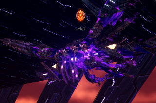

# Xenoblade3 ≫ エネミー一覧 ≫ 陸生生物

生態調査中なので逐一更新

## 種族一覧

- 虫
    - [フライア族](#フライア族)
    - [スキート族](#スキート族)
    - [ランプス族](#ランプス族)
    - [モスーン族](#モスーン族)
- 鳥
    - [クロード族](#クロード族)
    - [アンセル族](#アンセル族)
    - [ローグル族](#ローグル族)
    - [タオース族](#タオース族)
    - [フォルガ族](#フォルガ族)
- 哺乳類
    - [ヴァンプ族](#ヴァンプ族)
- 海洋生物
    - [マーリン族](#マーリン族)
    - [ロドン族](#ロドン族)
    - [ジェリー族](#ジェリー族)
- 謎
    - [モラモラ族](#モラモラ族)
    - [エキドナ族](#エキドナ族)
- オリジン
    - [メェスト](#メェスト)
    - [フォクク](#フォクク)

## フライア族

蛾

### 生息場所・名前

| 地方             | ロケーション                  | 名前               | レベル |
| ---------------- | ----------------------------- | ------------------ | ------ |
| アエティア地方   | 不死ヶ原                      | ライト・フライア   | 1-3    |
| アエティア地方   | アルフェト渓谷                | イルミ・フライア   | 10     |
| アエティア地方   | ミリク平原                    | イルミ・フライア   | 11-12  |
| アエティア地方   | ミリク平原/ビリエラ丘陵       | 攪乱のビルキン     | 13     |
| フォーニス地方   | リビ平原/カタラー兵陵         | プロム・フライア   | 17-18  |
| フォーニス地方   | ダナ砂漠/大鷲の翼             | リセス・フライア   | 23-24  |
| ペンテランス地方 | モルクナ大森林・上層          | バルカ・フライア   | 31-35  |
| アエティア地方   | 不死ヶ原                      | アミテ・フライア   | 41-42  |
| カデンシア地方   | 大剣の麓/刃先の渓谷道         | クロタ・フライア   | 45     |
| カデンシア地方   | 大剣の麓                      | クロタ・フライア   | 47     |
| カデンシア地方   | エルティア海/ミグロウ浮遊列島 | クロタ・フライア   | 45     |
| カデンシア地方   | エルティア海/ハーガン岬       | クロタ・フライア   | 45-47  |
| カデンシア地方   | エルティア海/魔獣の手のひら   | クロタ・フライア   | 47-48  |
| カデンシア地方   | アグヌス城下要塞              | クロタ・フライア   | 48-49  |
| カデンシア地方   | エルティア海/ファーレン岩窟道 | モルスラ・フライア | 53-56  |
| ペンテランス地方 | モルクナ大森林・上層          | ネクロ・フライア   | 60-62  |
|                  |                               |                    |        |

### ドロップアイテム

| アイテム           | ジェムクラフト | 必要数      |
| ------------------ | -------------- | ----------- |
| フライアの蜜ゼリー | 錬気救命VIII   | エピック×15 |
|                    |                |             |
|                    |                |             |

## スキート族

蚊

### 生息場所・名前

| 地方                   | ロケーション                        | 名前               | レベル |
| ---------------------- | ----------------------------------- | ------------------ | ------ |
| アエティア地方         | 不死ヶ原/リカーロの池               | ライト・スキート   | 1-3    |
| アエティア地方         | アルフェト渓谷                      | ライト・スキート   | 4-5    |
| アエティア地方         | アルフェト渓谷                      | イルミ・スキート   | 8      |
| フォーニス地方         | リビ平原/グルンの坂道               | テスラン・スキート | 17-19  |
| フォーニス地方         | リビ平原/カタラー兵陵               | テスラン・スキート | 18-19  |
| アエティア地方         | ミリク平原                          | アミテ・スキート   | 22-23  |
| アエティア地方         | ミリク平原/ムームルの丘             | アミテ・スキート   | 22-23  |
| アエティア地方         | アルフェト渓谷/クーレル水脈         | バルカ・スキート   | 25-26  |
| アエティア地方         | アルフェト渓谷/大観一望             | バルカ・スキート   | 26     |
| ペンテランス地方       | インヴィディア坑道                  | プロム・スキート   | 23-25  |
| ケヴェスキャッスル地方 | シウェラ浮遊岩礁地帯/第七浮遊岩礁   | ネクロ・スキート   | 36-37  |
| ケヴェスキャッスル地方 | シウェラ浮遊岩礁地帯/第六浮遊岩礁   | ネクロ・スキート   | 36-37  |
| アエティア地方         | ミリク平原                          | リセス・スキート   | 47     |
| アエティア地方         | カプトコルヌ山嶺                    | モルスラ・スキート | 48-52  |
| アエティア地方         | カプトコルヌ山嶺/ノキルア腐敗溜まり | モルスラ・スキート | 56-57  |
| アエティア地方         | 不死ヶ原/ロッツォ古戦場             | モルスラ・スキート | 56-57  |
| アエティア地方         | メルナス高地/クーレル湖             | モルスラ・スキート | 56-57  |
| アエティア地方         | イザナ平原/奏鳴の丘                 | セルライ・スキート | 20-21  |
| アエティア地方         | イザナ平原/シャヴィーネ空洞         | クロタ・スキート   | 49-50  |
|                        |                                     |                    |        |
|                        |                                     |                    |        |

### ドロップアイテム

| アイテム       | ジェムクラフト | 必要数      |
| -------------- | -------------- | ----------- |
| スキートの薄羽 | 追い風I        | コモン×1    |
| スキートの薄羽 | 追い風X        | エピック×30 |
| スキートの蜜   | 癒しの薫風VIII | エピック×15 |
|                |                |             |

## ランプス族

### 生息場所・名前

| 地方           | ロケーション              | 名前             | レベル |
| -------------- | ------------------------- | ---------------- | ------ |
| フォーニス地方 | ダナ砂漠/灼熱の大擂鉢     | ランプス         | 23-24  |
| カデンシア地方 | 大剣の麓                  | クロタ・ランプス | 40-42  |
| カデンシア地方 | 大剣の麓                  | 隠世のルミー     | 42     |
| カデンシア地方 | エルディア海/ディダーラ島 | リセス・ランプス | 70-71  |
|                |                           |                  |        |

### ドロップアイテム

| アイテム           | ジェムクラフト   | 必要数      |
| ------------------ | ---------------- | ----------- |
| ランプスの太陽粒子 | さらなる祝福VIII | エピック×15 |
|                    |                  |             |

## モスーン族

### 生息場所・名前

| 地方             | ロケーション              | 名前               | レベル |
| ---------------- | ------------------------- | ------------------ | ------ |
| ペンテランス地方 | モルクナ大森林・下層      | ロドモト・モスーン | 73-74  |
| カデンシア地方   | エルディア海/ディダーラ島 | カシウス・モスーン | 72-73  |
| カデンシア地方   | エルディア海/ディダーラ島 | 妖蟲のクレオノール | 75     |
|                  |                           |                    |        |

### ドロップアイテム

| アイテム         | ジェムクラフト | 必要数      |
| ---------------- | -------------- | ----------- |
| モスーンの爆炎粉 | 弱点解析VIII   | コモン×15   |
| モスーンの鎧羽   | 鉄壁の守りVIII | コモン×15   |
| モスーンの鎧羽   | 鉄壁の守りX    | エピック×30 |
|                  |                |             |

## クロード族

フクロウ

### 生息場所・名前

| 地方             | ロケーション                | 名前               | レベル |
| ---------------- | --------------------------- | ------------------ | ------ |
| アエティア地方   | アルフェト渓谷/奈落の崖道   | ルガー・クロード   | 9      |
| アエティア地方   | メルナス高地                | ルガー・クロード   | 9-10   |
| アエティア地方   | 不死ヶ原                    | ゲゲル・クロード   | 43     |
| カデンシア地方   | リ・ガート収容所/外郭森林区 | ナハティ・クロード | 47-48  |
| ペンテランス地方 | モルクナ大森林・下層        | ウィズダ・クロード | 72     |
|                  |                             |                    |        |

### ドロップアイテム

| アイテム         | ジェムクラフト   | 必要数      |
| ---------------- | ---------------- | ----------- |
| クロードの嗜好品 | さらなる呪いVIII | エピック×15 |
|                  |                  |             |
|                  |                  |             |

## アンセル族

### 生息場所・名前

| 地方             | [ロケーション](../../Maps/list.md) | 名前                   | レベル |
| ---------------- | ---------------------------------- | ---------------------- | ------ |
| フォーニス地方   | リビ平原/スパス丘陵                | アロガン・アンセル     | 21     |
| フォーニス地方   | リビ平原/バスラ島                  | アロガン・アンセル     | 21     |
| アエティア地方   | ミリク平原/ムームルの丘            | ブルート・アンセル     | 23     |
| フォーニス地方   | レーベ高原/ロミの丘                | ラプター・アンセル     | 23     |
| フォーニス地方   | レーベ高原/カーナの古戦場          | ラプター・アンセル     | 23     |
| カデンシア地方   | 大剣の麓/ノ・オム湿地帯            | コンバット・アンセル   | 42-43  |
| ペンテランス地方 | インヴィディア山道                 | スナイプ・アンセル     | 45-46  |
| フォーニス地方   | レーベ高原/エルセア山峡            | マッドタロン・アンセル | 45-46  |
| カデンシア地方   | アグヌス城下要塞/極点の桟道        | シーカー・アンセル     | 49     |
| アエティア地方   | カプトコルヌ山嶺/ザンクの道        | スカーエッジ・アンセル | 51-52  |
| アエティア地方   | カプトコルヌ山嶺/ラドラスの道      | スカーエッジ・アンセル | 55-56  |
| カデンシア地方   | エルティア海/ファーレン岩窟道      | ハンター・アンセル     | 53-55  |
| アエティア地方   | 不死ヶ原/ロッツォの古戦場跡        | スカーエッジ・アンセル | 58     |
| アエティア地方   | 不死ヶ原/ロッツォの古戦場跡        | 魔風のクジャータ       | 59     |
|                  |                                    |                        |        |

### ドロップアイテム

| アイテム           | ジェムクラフト | 必要数      |
| ------------------ | -------------- | ----------- |
| アンセルの圧縮肉   | 双撃III        | コモン×1    |
| アンセルの圧縮肉   | 双撃V          | レア×2      |
| アンセルの優美な羽 | 追い風VIII     | エピック×15 |
|                    |                |             |

## ローグル族

### 生息場所・名前

| 地方             | [ロケーション](../../Maps/list.md) | 名前               | レベル |
| ---------------- | ---------------------------------- | ------------------ | ------ |
| アエティア地方   | イザナ平原                         | スカイ・ローグル   | 6      |
| アエティア地方   | アルフェト渓谷                     | スカイ・ローグル   | 7-8    |
| アエティア地方   | ミリク平原                         | アロガン・ローグル | 13-14  |
| アエティア地方   | メルナス高地/物見の一本橋          | スマート・ローグル | 27-28  |
| ペンテランス地方 | コンティ大瀑布                     | ラプター・ローグル | 28-29  |
| ペンテランス地方 | コンティ大瀑布                     | 沖天のヴァーゼ     | 36     |
| ペンテランス地方 | モルクナ大森林・上層               | スナイプ・ローグル | 35-36  |
| ペンテランス地方 | コンティ大瀑布                     | エッグィ・ローグル | 64     |
| 大剣             | 滅光の虚/崩落した通路              | シーカー・ローグル | 88-89  |
| 大剣             | 滅光の虚/崩落した通路              | 翔天のイグレット   | 90     |
|                  |                                    |                    |        |

### ドロップアイテム

| アイテム | ジェムクラフト |     |
| -------- | -------------- | --- |
|          |                |     |
|          |                |     |

## タオース族

### 生息場所・名前

| リージョン     | [ロケーション](../../Maps/list.md) | 名前                 | レベル |
| -------------- | ---------------------------------- | -------------------- | ------ |
| フォーニス地方 | イーグス荒野/ルイドの谷            | ボーゲン・タオース   | 15     |
| フォーニス地方 | イーグス荒野/掌中の長城            | ボーゲン・タオース   | 14-15  |
| フォーニス地方 | イーグス荒野/ニールの谷            | アルメ・タオース     | 16     |
| カデンシア地方 | 大剣の麓/刃先の渓谷道              | ヴァッヘ・タオース   | 46-47  |
| カデンシア地方 | エルティア海/ディダーラ島          | シュペーア・タオース | 74-75  |
| 大剣           | 滅光の虚/崩落した通路              | ゼンゼ・タオース     | 90     |
| 大剣           | 滅光の虚                           | ゼンゼ・タオース     | 89-90  |
|                |                                    |                      |        |

### ドロップアイテム

| アイテム         | ジェムクラフト | 必要数      |
| ---------------- | -------------- | ----------- |
| タオースの手羽先 | 双撃III        | コモン×1    |
| タオースの手羽先 | 双撃X          | エピック×30 |
|                  |                |             |
|                  |                |             |

## フォルガ族

ワシ

### 生息場所・名前

| 地方           | ロケーション                | 名前                 | レベル |
| -------------- | --------------------------- | -------------------- | ------ |
| カデンシア地方 | アグヌス城下要塞/輪廻の古道 | ラファール・フォルガ | 51     |
| カデンシア地方 | エルティア海/ラヴィア砂丘島 | ビューネス・フォルガ | 65     |
| アエティア地方 | メルナス高地/クーレル湖     | 禍ツ翼のリュウホウ   | 100    |
|                |                             |                      |        |

### ドロップアイテム

| アイテム           | ジェムクラフト | 必要数      |
| ------------------ | -------------- | ----------- |
| フォルガの仮面     | 殺気消失VIII   | コモン×15   |
| フォルガの烈風大翼 | 双撃VI         | レア×2      |
| フォルガの烈風大翼 | 双撃VII        | コモン×2    |
| フォルガの烈風大翼 | 双撃X          | エピック×30 |
|                    |                |             |

## ヴァンプ族

コウモリ

### 生息場所・名前

| 地方             | ロケーション                    | 名前                 | レベル      |
| ---------------- | ------------------------------- | -------------------- | ----------- |
| アエティア地方   | アルフェト渓谷/隠者の抜け道     | シャドウ・ヴァンプ   | 8-9         |
| アエティア地方   | ミリク平原/鬼哭洞               | シャドウ・ヴァンプ   | 10-11,23-24 |
| フォーニス地方   | イーグス荒野/ベネル洞窟         | キャリアー・キャピル | 14-15       |
| フォーニス地方   | イーグス荒野/長城の裏庭         | バイト・ヴァンプ     | 16-17       |
| ペンテランス地方 | インヴィディア坑道              | ライアー・ヴァンプ   | 23-24       |
| ペンテランス地方 | インヴィディア坑道/第一採掘場   | ライアー・ヴァンプ   | 23-24       |
| フォーニス地方   | レーベ高原/ペラト洞窟           | ガスト・ヴァンプ     | 22-23       |
| フォーニス地方   | エレス大道/ニドの洞窟           | スケア・ヴァンプ     | 41-42       |
| ペンテラス地方   | インヴィディア山道/ロスカ洞窟   | コロエラ・ヴァンプ   | 44          |
| カデンシア地方   | アグヌス城下要塞/海風の浸食洞窟 | フェンダー・ヴァンプ | 45          |
| カデンシア地方   | エルティア海/ラヴィア砂丘島     | アメリス・ヴァンプ   | 61          |
| アエティア地方   | エルガレス地下洞窟入口          | シュレッド・ヴァンプ | 76-77       |
| アエティア地方   | ミリク平原                      | シュレッド・ヴァンプ | 76-77       |
|                  |                                 |                      |             |

### ドロップアイテム

| アイテム       | ジェムクラフト | 必要数      |
| -------------- | -------------- | ----------- |
| ヴァンプの被膜 | 追い風II       | コモン×1    |
| ヴァンプの被膜 | 追い風III      | レア×1      |
| ヴァンプの被膜 | 追い風VIII     | エピック×15 |
|                |                |             |

## マーリン族

カジキ

### 生息場所・名前

| 地方           | ロケーション                | 名前                 | レベル |
| -------------- | --------------------------- | -------------------- | ------ |
| フォーニス地方 | ダナ砂漠                    | エクリプス・マーリン | 56     |
| カデンシア地方 | エルティア海/ラヴィア砂丘島 | オシアン・マーリン   | 66     |
| フォーニス地方 | ダナ砂漠/灼熱の大擂鉢       | 大砂海のマーセラス   | 87     |

### ドロップアイテム

| アイテム         | ジェムクラフト | 必要数      |
| ---------------- | -------------- | ----------- |
| マーリンの一本骨 | 強化連撃VIII   | コモン×15 |
|                  |                |             |

## ロドン族

### 生息場所・名前

| 地方           | ロケーション                | 名前               | レベル |
| -------------- | --------------------------- | ------------------ | ------ |
| フォーニス地方 | レーベ高原/リエス湖         | アビスデア・ロドン | 55     |
| カデンシア地方 | エルティア海/至天の滝       | 幽界のロッドシルト | 60     |
| フォーニス地方 | エレス大道/ロレーテの大岩棚 | ゼオース・ロドン   | 60-61  |
| フォーニス地方 | エレス大道/カディオンの崖道 | ゼオース・ロドン   | 61     |
| カデンシア地方 | エルティア海                | ヴィダス・ロドン   | 64     |
|                |                             |                    |        |

### ドロップアイテム

| アイテム       | ジェムクラフト | 必要数      |
| -------------- | -------------- | ----------- |
| ロドンの大トロ | 鋼の肉体VIII   | エピック×15 |
|                |                |             |
|                |                |             |

## ジェリー族

### 生息場所・名前

| 地方             | ロケーション                          | 名前               | レベル |
| ---------------- | ------------------------------------- | ------------------ | ------ |
| ペンテランス地方 | コンティ大瀑布                        | スケルト・ジェリー | 27-28  |
| ペンテランス地方 | コンティ大瀑布/コンティのカラクリ遺跡 | 幻光のアスタリスク | 35     |
| カデンシア地方   | 大剣の麓                              | チェリス・ジェリー | 41     |
| カデンシア地方   | 大剣の麓/ノ・オム湿地帯               | チェリス・ジェリー | 41-43  |
| カデンシア地方   | エルティア海/邪念の空洞               | ブリンク・ジェリー | 95-96  |
|                  |                                       |                    |        |

### ドロップアイテム

| アイテム         | ジェムクラフト | 必要数      |
| ---------------- | -------------- | ----------- |
| ジェリーの触手   | 双撃IV         | コモン×1    |
| ジェリーの弾む傘 | 危険存在VIII   | エピック×15 |
|                  |                |             |
|                  |                |             |

## モラモラ族

### 生息場所・名前

| 地方                   | ロケーション                      | 名前                 | レベル |
| ---------------------- | --------------------------------- | -------------------- | ------ |
| ペンテランス地方       | インヴィディア坑道                | エイング・モラモラ   | 26-27  |
| アエティア地方         | ミリク平原/ムームルの丘           | ロポス・モラモラ     | 25-26  |
| アエティア地方         | メルナス高地/大観一望             | ロポス・モラモラ     | 27-28  |
| ケヴェスキャッスル地方 | シウェラ浮遊岩礁地帯/第七浮遊岩礁 | ダイバー・モラモラ   | 37-38  |
| ケヴェスキャッスル地方 | シウェラ浮遊岩礁地帯/第七浮遊岩礁 | 伏魔のリンドヴル     | 49     |
| カデンシア地方         | エルティア海/アヌ群島             | トトリオ・モラモラ   | 48-49  |
| カデンシア地方         | エルティア海/アルカフォール半島   | ハイウィン・モラモラ | 57     |
| アエティア地方         | メルナス高地/クーレル湖           | ディーパー・モラモラ | 59-60  |
| カデンシア地方         | エルティア海/ブラス熱泉地帯       | オニトビ・モラモラ   | 62     |
| カデンシア地方         | エルティア海/ブラス温泉           | オニトビ・モラモラ   | 62     |
| アエティア地方         | アルフェト渓谷                    | ディーパー・モラモラ | 70     |
| アエティア地方         | エルガレス地下洞窟                | モービル・モラモラ   | 79-80  |
|                        |                                   |                      |        |

### ドロップアイテム

| アイテム | ジェムクラフト |     |
| -------- | -------------- | --- |
|          |                |     |
|          |                |     |

## エキドナ族

### 生息場所・名前

| 地方                   | ロケーション                      | 名前               | レベル |
| ---------------------- | --------------------------------- | ------------------ | ------ |
| ケヴェスキャッスル地方 | シウェラ浮遊岩礁地帯/第四浮遊岩礁 | クリンゲ・エキドナ | 37-38  |
| ケヴェスキャッスル地方 | シウェラ浮遊岩礁地帯/第三浮遊岩礁 | クリンゲ・エキドナ | 37-38  |
| ケヴェスキャッスル地方 | シウェラ浮遊岩礁地帯/第二浮遊岩礁 | クリンゲ・エキドナ | 38     |
| ケヴェスキャッスル地方 | シウェラ浮遊岩礁地帯/第一浮遊岩礁 | クリンゲ・エキドナ | 38     |
| ケヴェスキャッスル地方 | シウェラ浮遊岩礁地帯/第四浮遊岩礁 | 烈日のカーライル   | 40     |
| ケヴェスキャッスル地方 | シウェラ浮遊岩礁地帯/エクダソの崖 | クリンゲ・エキドナ | 42     |
|                        |                                   |                    |        |

### ドロップアイテム

| アイテム       | ジェムクラフト | 必要数      |
| -------------- | -------------- | ----------- |
| エキドナの大顎 | 双撃X          | エピック×30 |
| エキドナの尻尾 | 絶対反撃IX     | コモン×20   |
|                |                |             |

## メェスト

### 生息場所・名前

| リージョン | [ロケーション](../../Maps/list.md) | 名前             | レベル |
| ---------- | ---------------------------------- | ---------------- | ------ |
| オリジン   | オリジン内部/第一増幅器            | エル・メェスト   | 63     |
| オリジン   | オリジン内部/第一鉄巨神工廠        | エル・メェスト   | 63     |
| オリジン   | オリジン内部/第三鉄巨神工廠        | エル・メェスト   | 62-63  |
| オリジン   | オリジン内部/第三鉄巨神工廠        | 冒涜のイシュマー | 65     |
|            |                                    |                  |        |

### ドロップアイテム

| アイテム             | ジェムクラフト   | 必要数     |
| -------------------- | ---------------- | ---------- |
| メェストの幾何学ギア | さらなる祝福VIII | コモン×15  |
| メェストの幾何学ギア | 錬気救命IX       | レア×20    |
| メェストの幾何学ギア | 追い風VII        | エピック×2 |

## フォクク

### 生息場所・名前

| リージョン | [ロケーション](../../Maps/list.md) | 名前             | レベル |
| ---------- | ---------------------------------- | ---------------- | ------ |
| オリジン   | オリジン内部/北面外殻通路          | エル・フォクク   | 64-65  |
| オリジン   | オリジン内部/南面外殻通路          | エル・フォクク   | 64-65  |
| オリジン   | オリジン内部/格納庫 下層中央ゲート | 嬌名のオルロワル | 86     |
|            |                                    |                  |        |

### ドロップアイテム

| アイテム         | ジェムクラフト | 必要数    |
| ---------------- | -------------- | --------- |
| フォククの金属片 | 鉄壁の守りVIII | コモン×15 |
| フォククの背骨   | 命中技巧VIII   | コモン×15 |
| フォククの金属片 | 鉄壁の守りX    | レア×30   |
